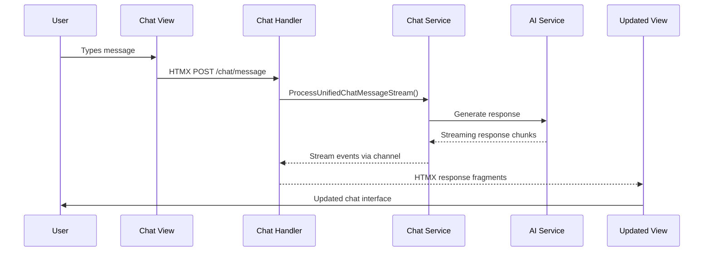
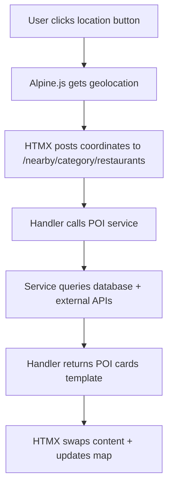

# Comprehensive Architecture Documentation
## Views, Services, and Streaming with Templ + HTMX + Alpine.js

This document provides extensive documentation on the architecture of the go-templui application, showing how views relate to services, how HTMX patterns are implemented, and how streaming should be implemented across the stack.

---

## Table of Contents

1. [Architecture Overview](#architecture-overview)
2. [View Layer Architecture](#view-layer-architecture)
3. [Service Layer Architecture](#service-layer-architecture)
4. [View-Service Relationships](#view-service-relationships)
5. [HTMX Integration Patterns](#htmx-integration-patterns)
6. [Streaming Implementation Guide](#streaming-implementation-guide)
7. [Alpine.js Integration](#alpinejs-integration)
8. [Best Practices and Patterns](#best-practices-and-patterns)
9. [Advanced Use Cases](#advanced-use-cases)

---

## Architecture Overview

### Tech Stack
- **Backend**: Go + Gin framework
- **Templates**: Templ (type-safe Go templates)
- **Frontend Interactivity**: HTMX + Alpine.js
- **Database**: PostgreSQL with pgx driver
- **External APIs**: Google Gemini AI, Mapbox
- **Observability**: OpenTelemetry, Prometheus, Grafana

### Directory Structure
```
app/
├── lib/                           # Frontend components and features
│   ├── components/               # Reusable UI components
│   │   ├── map/                 # Mapbox integration
│   │   ├── navbar/              # Navigation component
│   │   ├── footer/              # Footer component
│   │   └── ...
│   ├── features/                # Feature-specific views
│   │   ├── auth/                # Authentication views
│   │   ├── chat/                # Chat interface
│   │   ├── discover/            # Discovery feature
│   │   ├── nearby/              # Nearby POIs
│   │   ├── itinerary/           # Trip planning
│   │   ├── favorites/           # User favorites
│   │   └── ...
│   ├── models/                  # Data models and types
│   └── pages/                   # Layout templates
├── pkg/                          # Backend services and handlers
│   ├── domain/                  # Business logic services
│   │   ├── auth/               # Authentication service
│   │   ├── llmChat/        # AI chat service
│   │   ├── poi/                # POI management
│   │   ├── profiles/           # User profiles
│   │   └── ...
│   ├── handlers/               # HTTP handlers (HTMX endpoints)
│   └── middleware/             # HTTP middleware
└── routes/                      # Route configuration
```

---

## View Layer Architecture

### Templ Templates Structure

#### 1. Layout Templates (`lib/pages/`)
```go
// layout.templ
package pages

templ LayoutPage(l models.LayoutTempl) {
    <!DOCTYPE html>
    <html lang="en">
        <head>
            @mapcomponents.MapboxScripts()  // External scripts
            <script src="https://unpkg.com/htmx.org@2.0.0/dist/htmx.min.js"></script>
            <script defer src="https://cdn.jsdelivr.net/npm/alpinejs@3.14.0/dist/cdn.min.js"></script>
        </head>
        <body hx-boost="true">
            @navbar.NavBar(l.Nav, l.User)   // Reusable components
            <main>
                @l.Content                   // Dynamic content
            </main>
            @footer.Footer()
        </body>
    </html>
}
```

#### 2. Feature Templates (`lib/features/`)

**Chat Feature** (`lib/features/chat/chat.templ`):
```go
templ ChatPage() {
    <div class="chat-container">
        <div id="chat-messages">
            // Welcome message
        </div>
        
        // HTMX-powered chat form
        <form 
            hx-post="/chat/message" 
            hx-trigger="submit" 
            hx-target="#chat-messages" 
            hx-swap="beforeend"
            hx-indicator="#chat-loading"
        >
            <textarea name="message" id="chat-input"></textarea>
            <button type="submit">Send</button>
            <span id="chat-loading" class="htmx-indicator">Loading...</span>
        </form>
    </div>
}
```

**Nearby Feature** (`lib/features/nearby/nearby.templ`):
```go
templ NearbyPage() {
    <div x-data="nearbyController()" class="container">
        // Location controls
        <button 
            id="location-btn" 
            @click="getUserLocation()"
        >Use My Location</button>
        
        // Category tabs with HTMX
        <nav id="category-tabs">
            <button 
                hx-post="/nearby/category/restaurants"
                hx-target="#poi-results"
                hx-include="#filters-form"
                :class="{'active': activeTab === 'restaurants'}"
                @click="activeTab = 'restaurants'"
            >Restaurants</button>
        </nav>
        
        // Filter form
        <form id="filters-form" x-ref="filtersForm">
            <input type="hidden" name="latitude" x-model="location.lat" />
            <input type="hidden" name="longitude" x-model="location.lng" />
        </form>
        
        // Results container
        <div id="poi-results"></div>
        
        // Map integration
        @mapcomponents.MapboxContainer("nearby-map", "100%")
    </div>
}
```

#### 3. Component Templates (`lib/components/`)

**Reusable POI Card**:
```go
templ NearbyPOICard(poi models.NearbyPOI) {
    <div class="poi-card" 
         x-data="{favorited: false}"
         :class="{'favorited': favorited}">
        <h3>{poi.Name}</h3>
        <p>{poi.Category}</p>
        
        // HTMX actions
        <button 
            hx-post={"/favorites/add/" + poi.ID}
            hx-target="this"
            hx-swap="outerHTML"
            @click="favorited = true"
        >
            <i class="far fa-heart"></i>
        </button>
    </div>
}
```

---

## Service Layer Architecture

### Domain Services Structure

#### 1. Chat Service (`pkg/domain/llmChat/chat_service.go`)

**Service Interface**:
```go
type LlmInteractionService interface {
    // Streaming chat methods
    ProcessUnifiedChatMessageStream(
        ctx context.Context, 
        userID, profileID uuid.UUID, 
        cityName, message string, 
        userLocation *models.UserLocation, 
        eventCh chan<- models.StreamEvent
    ) error
    
    ContinueSessionStreamed(
        ctx context.Context,
        sessionID uuid.UUID,
        message string,
        userLocation *models.UserLocation,
        eventCh chan<- models.StreamEvent,
    ) error
    
    // Synchronous methods
    SaveItenerary(ctx context.Context, userID uuid.UUID, req models.BookmarkRequest) (uuid.UUID, error)
    GetBookmarkedItineraries(ctx context.Context, userID uuid.UUID, page, limit int) (*models.PaginatedUserItinerariesResponse, error)
}
```

**Service Implementation**:
```go
type ServiceImpl struct {
    logger             *zap.Logger
    interestRepo       interests.Repository
    searchProfileRepo  profiles.Repository
    tagsRepo           tags.Repository
    aiClient           *generativeAI.LLMChatClient
    embeddingService   *generativeAI.EmbeddingService
    llmInteractionRepo Repository
    cityRepo           city.Repository
    poiRepo            poi.Repository
    cache              *cache.Cache
    intentClassifier   IntentClassifier
}
```

#### 2. POI Service (`pkg/domain/poi/poi_service.go`)

```go
type Service interface {
    GetPOIsByLocation(ctx context.Context, lat, lng float64, radius float64) ([]models.POIDetailedInfo, error)
    SearchPOIs(ctx context.Context, query string, filters models.POIFilter) ([]models.POIDetailedInfo, error)
    GetPOIDetails(ctx context.Context, poiID uuid.UUID) (*models.POIDetailedInfo, error)
    AddPOIToFavorites(ctx context.Context, userID, poiID uuid.UUID) error
}
```

#### 3. User Profile Service (`pkg/domain/profiles/profile_service.go`)

```go
type Service interface {
    CreateProfile(ctx context.Context, profile models.UserProfile) (*models.UserProfile, error)
    GetProfile(ctx context.Context, userID uuid.UUID) (*models.UserProfile, error)
    UpdatePreferences(ctx context.Context, userID uuid.UUID, prefs models.UserPreferences) error
    GetPersonalizedRecommendations(ctx context.Context, userID uuid.UUID, location models.UserLocation) ([]models.POIDetailedInfo, error)
}
```

---

## View-Service Relationships

### 1. Chat Feature Flow

**View → Handler → Service → View**



**Implementation Details**:

*View* (`lib/features/chat/chat.templ`):
```go
<form 
    hx-post="/chat/message"
    hx-target="#chat-messages"
    hx-swap="beforeend"
    hx-trigger="submit"
>
    <textarea name="message"></textarea>
</form>
```

*Handler* (`pkg/handlers/chat.go`):
```go
func (h *ChatHandlers) SendMessage(c *gin.Context) {
    message := c.PostForm("message")
    userID := middleware.GetUserIDFromContext(c)
    
    // Call service
    response := h.chatService.ProcessMessage(ctx, userID, message)
    
    // Return HTMX response
    c.String(http.StatusOK, `
        <div class="user-message">`+message+`</div>
        <div class="ai-response">`+response+`</div>
    `)
}
```

*Service* (`pkg/domain/llmChat/chat_service.go`):
```go
func (s *ServiceImpl) ProcessMessage(ctx context.Context, userID uuid.UUID, message string) string {
    // Business logic
    // AI interaction
    // Database operations
    return response
}
```

### 2. Nearby Feature Flow

**Location-based POI Discovery**:



*View* (`lib/features/nearby/nearby.templ`):
```go
<div x-data="nearbyController()">
    <button @click="getUserLocation()" id="location-btn">Use My Location</button>
    
    <nav>
        <button 
            hx-post="/nearby/category/restaurants"
            hx-target="#poi-results"
            hx-include="#filters-form"
        >Restaurants</button>
    </nav>
    
    <form id="filters-form">
        <input type="hidden" name="latitude" x-model="location.lat" />
        <input type="hidden" name="longitude" x-model="location.lng" />
    </form>
    
    <div id="poi-results">
        // POI cards will be injected here
    </div>
</div>

<script>
function nearbyController() {
    return {
        location: { lat: null, lng: null },
        activeTab: 'general',
        
        getUserLocation() {
            navigator.geolocation.getCurrentPosition(
                (position) => {
                    this.location.lat = position.coords.latitude;
                    this.location.lng = position.coords.longitude;
                    // Trigger HTMX request
                    htmx.trigger('#category-tabs button.active', 'click');
                }
            );
        }
    }
}
</script>
```

*Handler* (`pkg/handlers/nearby.go`):
```go
func (h *NearbyHandlers) GetPOIsByCategory(c *gin.Context) {
    category := c.Param("category")
    lat, _ := strconv.ParseFloat(c.PostForm("latitude"), 64)
    lng, _ := strconv.ParseFloat(c.PostForm("longitude"), 64)
    
    // Call service
    pois := h.poiService.GetPOIsByLocation(ctx, lat, lng, 5.0)
    filteredPOIs := h.applyFilters(pois, category)
    
    // Return template
    c.HTML(http.StatusOK, "", nearby.NearbyPOIResults(filteredPOIs))
}
```

### 3. Itinerary Feature Flow

**AI-Powered Trip Planning**:

*View* (`lib/features/itinerary/itinerary.templ`):
```go
<div class="split-layout">
    <!-- Chat Panel -->
    <div class="chat-panel">
        <form 
            hx-post="/itinerary/chat"
            hx-target="#chat-messages"
            hx-swap="beforeend"
            hx-include="#destination-input, #trip-duration, #trip-budget"
        >
            <textarea name="message"></textarea>
        </form>
        
        <div id="chat-messages">
            @ItineraryWelcomeMessage()
        </div>
    </div>
    
    <!-- Map Panel -->
    <div class="map-panel">
        @mapcomponents.MapboxContainer("itinerary-map", "100%")
        
        <div class="itinerary-summary">
            <div id="itinerary-summary"></div>
        </div>
    </div>
</div>
```

*Handler* (`pkg/handlers/itinerary.go`):
```go
func (h *ItineraryHandlers) HandleChat(c *gin.Context) {
    message := c.PostForm("message")
    destination := c.PostForm("destination-input")
    duration := c.DefaultPostForm("duration", "5")
    
    // Generate AI response
    aiResponse := h.generateItineraryResponse(message, destination, duration)
    
    // Create chat messages
    userMessage := models.ChatMessage{Content: message, Timestamp: time.Now().Format("3:04 PM")}
    aiMessage := models.ChatMessage{Content: aiResponse, Timestamp: time.Now().Format("3:04 PM")}
    
    // Return both messages
    c.HTML(http.StatusOK, "", templ.Raw(fmt.Sprintf(`%s%s`, 
        renderChatMessage(userMessage, true),
        renderChatMessage(aiMessage, false),
    )))
}
```

---

## HTMX Integration Patterns

### 1. Basic Request/Response Pattern

**Form Submission**:
```go
<form 
    hx-post="/api/endpoint"
    hx-target="#result-container"
    hx-swap="innerHTML"
    hx-trigger="submit"
>
    <input name="field" />
    <button type="submit">Submit</button>
</form>
```

**Handler Response**:
```go
func Handler(c *gin.Context) {
    data := c.PostForm("field")
    result := processData(data)
    
    // Return HTML fragment
    c.HTML(http.StatusOK, "", component.ResultTemplate(result))
}
```

### 2. Dynamic Content Loading

**Lazy Loading**:
```go
<div 
    hx-get="/api/load-content"
    hx-trigger="revealed"
    hx-indicator="#loading"
>
    <div id="loading" class="htmx-indicator">Loading...</div>
</div>
```

### 3. Real-time Updates

**Polling Pattern**:
```go
<div 
    hx-get="/api/status"
    hx-trigger="every 2s"
    hx-target="this"
    hx-swap="innerHTML"
>
    Current status will appear here
</div>
```

**WebSocket Alternative with HTMX**:
```go
<div 
    hx-ext="ws"
    ws-connect="/ws/chat"
>
    <div id="chat-messages"></div>
    <form ws-send>
        <input name="message" />
    </form>
</div>
```

### 4. Complex Form Interactions

**Dependent Dropdowns**:
```go
<select 
    name="category"
    hx-post="/api/subcategories"
    hx-target="#subcategory-select"
    hx-trigger="change"
>
    <option value="restaurants">Restaurants</option>
    <option value="hotels">Hotels</option>
</select>

<select id="subcategory-select" name="subcategory">
    <!-- Options loaded via HTMX -->
</select>
```

### 5. Search with Debouncing

```go
<input 
    type="text"
    name="query"
    hx-post="/api/search"
    hx-target="#search-results"
    hx-trigger="input changed delay:500ms"
    placeholder="Search..."
/>

<div id="search-results">
    <!-- Search results appear here -->
</div>
```

---

## Streaming Implementation Guide

### 1. Server-Sent Events (SSE) with HTMX

**Template Setup**:
```go
templ ChatStreamingPage() {
    <div class="chat-container">
        <div id="chat-messages"></div>
        
        <form hx-post="/chat/stream" hx-target="#chat-messages" hx-swap="beforeend">
            <input name="message" />
            <button type="submit">Send</button>
        </form>
        
        // SSE connection for streaming responses
        <div 
            hx-ext="sse"
            sse-connect="/chat/stream/events"
            sse-swap="message"
            hx-target="#chat-messages"
            hx-swap="beforeend"
        ></div>
    </div>
}
```

**Handler Implementation**:
```go
func (h *ChatHandlers) HandleStreamingChat(c *gin.Context) {
    message := c.PostForm("message")
    userID := middleware.GetUserIDFromContext(c)
    
    // Return user message immediately
    c.HTML(http.StatusOK, "", chat.UserMessage(message))
    
    // Start streaming response in background
    go h.streamAIResponse(userID, message)
}

func (h *ChatHandlers) StreamEvents(c *gin.Context) {
    c.Header("Content-Type", "text/event-stream")
    c.Header("Cache-Control", "no-cache")
    c.Header("Connection", "keep-alive")
    
    // Create event channel
    eventCh := make(chan models.StreamEvent, 10)
    defer close(eventCh)
    
    // Start streaming service
    go h.chatService.ProcessUnifiedChatMessageStream(
        c.Request.Context(),
        userID, profileID,
        cityName, message,
        userLocation,
        eventCh,
    )
    
    // Stream events to client
    for event := range eventCh {
        data, _ := json.Marshal(event)
        fmt.Fprintf(c.Writer, "data: %s\n\n", data)
        c.Writer.Flush()
        
        if event.IsFinal {
            break
        }
    }
}
```

**Service Streaming Implementation**:
```go
func (s *ServiceImpl) ProcessUnifiedChatMessageStream(
    ctx context.Context,
    userID, profileID uuid.UUID,
    cityName, message string,
    userLocation *models.UserLocation,
    eventCh chan<- models.StreamEvent,
) error {
    defer func() {
        eventCh <- models.StreamEvent{
            Type:      models.EventTypeComplete,
            IsFinal:   true,
            Timestamp: time.Now(),
        }
    }()
    
    // Send start event
    eventCh <- models.StreamEvent{
        Type:      models.EventTypeStart,
        Message:   "Processing your request...",
        Timestamp: time.Now(),
    }
    
    // Domain detection
    domain := s.domainDetector.DetectDomain(ctx, message)
    eventCh <- models.StreamEvent{
        Type:      models.EventTypeDomainDetected,
        Message:   fmt.Sprintf("Detected domain: %s", domain),
        Data:      map[string]string{"domain": string(domain)},
        Timestamp: time.Now(),
    }
    
    // City data
    cityData, err := s.cityRepo.GetCityByName(ctx, cityName)
    if err == nil {
        eventCh <- models.StreamEvent{
            Type:      models.EventTypeCityData,
            Data:      cityData,
            Timestamp: time.Now(),
        }
    }
    
    // Stream AI response chunks
    responseStream := s.aiClient.StreamCompletion(ctx, prompt)
    for chunk := range responseStream {
        eventCh <- models.StreamEvent{
            Type:      models.EventTypeChunk,
            Message:   chunk.Text,
            Timestamp: time.Now(),
        }
    }
    
    return nil
}
```

### 2. Progressive Enhancement Pattern

**Template with Progressive Loading**:
```go
templ ItineraryStreamingPage() {
    <div class="itinerary-container">
        <div class="chat-panel">
            <div id="chat-messages">
                @ItineraryWelcomeMessage()
            </div>
            
            <form hx-post="/itinerary/stream" hx-target="#chat-messages" hx-swap="beforeend">
                <textarea name="message"></textarea>
                <button type="submit">Plan Trip</button>
            </form>
        </div>
        
        <div class="content-panels">
            <!-- City Info Panel -->
            <div id="city-info" class="panel">
                <div class="loading-state">
                    <div class="skeleton"></div>
                </div>
            </div>
            
            <!-- POI Panel -->
            <div id="poi-lists" class="panel">
                <div class="loading-state">
                    <div class="skeleton"></div>
                </div>
            </div>
            
            <!-- Itinerary Panel -->
            <div id="final-itinerary" class="panel">
                <div class="loading-state">
                    <div class="skeleton"></div>
                </div>
            </div>
        </div>
        
        <!-- SSE connection for progressive updates -->
        <div 
            hx-ext="sse"
            sse-connect="/itinerary/stream/events"
            sse-swap="city_data:#city-info"
            sse-swap="general_poi:#poi-lists"
            sse-swap="itinerary:#final-itinerary"
        ></div>
    </div>
}

templ CityDataPanel(city models.GeneralCityData) {
    <div class="city-panel">
        <h2>{city.City}, {city.Country}</h2>
        <p>{city.Description}</p>
        <div class="city-stats">
            <span>Population: {city.Population}</span>
            <span>Area: {city.Area}</span>
        </div>
    </div>
}

templ POIListPanel(pois []models.POIDetailedInfo) {
    <div class="poi-panel">
        <h3>Points of Interest</h3>
        <div class="poi-grid">
            for _, poi := range pois {
                @POICard(poi)
            }
        </div>
    </div>
}
```

### 3. Real-time Chat with Streaming

**Advanced Streaming Chat Handler**:
```go
func (h *ChatHandlers) StreamingChatHandler(c *gin.Context) {
    message := c.PostForm("message")
    sessionID := c.PostForm("session_id")
    userID := middleware.GetUserIDFromContext(c)
    
    // Parse session ID
    sessionUUID, _ := uuid.Parse(sessionID)
    
    // Return user message immediately
    userMsg := models.ChatMessage{
        Content:   message,
        Role:      "user",
        Timestamp: time.Now().Format("3:04 PM"),
    }
    c.HTML(http.StatusOK, "", chat.ChatMessage(userMsg, true))
    
    // Start background streaming
    go func() {
        eventCh := make(chan models.StreamEvent, 10)
        defer close(eventCh)
        
        // Process with streaming
        err := h.chatService.ContinueSessionStreamed(
            context.Background(),
            sessionUUID,
            message,
            nil, // user location
            eventCh,
        )
        
        if err != nil {
            log.Printf("Streaming error: %v", err)
            return
        }
    }()
}

func (h *ChatHandlers) ChatSSEEndpoint(c *gin.Context) {
    c.Header("Content-Type", "text/event-stream")
    c.Header("Cache-Control", "no-cache")
    c.Header("Connection", "keep-alive")
    c.Header("Access-Control-Allow-Origin", "*")
    
    sessionID := c.Query("session_id")
    userID := middleware.GetUserIDFromContext(c)
    
    // Subscribe to session events
    eventCh := h.chatService.SubscribeToSession(sessionID)
    defer h.chatService.UnsubscribeFromSession(sessionID, eventCh)
    
    for {
        select {
        case event := <-eventCh:
            switch event.Type {
            case models.EventTypeChunk:
                // Send partial AI response
                fmt.Fprintf(c.Writer, "event: ai_chunk\n")
                fmt.Fprintf(c.Writer, "data: %s\n\n", event.Message)
                
            case models.EventTypeCityData:
                // Send city information
                data, _ := json.Marshal(event.Data)
                fmt.Fprintf(c.Writer, "event: city_data\n")
                fmt.Fprintf(c.Writer, "data: %s\n\n", data)
                
            case models.EventTypeGeneralPOI:
                // Send POI data
                data, _ := json.Marshal(event.Data)
                fmt.Fprintf(c.Writer, "event: poi_data\n")
                fmt.Fprintf(c.Writer, "data: %s\n\n", data)
                
            case models.EventTypeComplete:
                // Send completion signal
                fmt.Fprintf(c.Writer, "event: complete\n")
                fmt.Fprintf(c.Writer, "data: {\"status\": \"completed\"}\n\n")
                return
            }
            c.Writer.Flush()
            
        case <-c.Request.Context().Done():
            return
        }
    }
}
```

---

## Alpine.js Integration

### 1. State Management

**Component State**:
```go
templ ComponentWithState() {
    <div x-data="componentController()" class="component">
        <div class="search-section">
            <input 
                x-model="query"
                @input="debouncedSearch()"
                placeholder="Search..."
            />
            <div x-show="loading" class="loading">Searching...</div>
        </div>
        
        <div class="results" x-show="results.length > 0">
            <template x-for="result in results" :key="result.id">
                <div class="result-item" @click="selectResult(result)">
                    <span x-text="result.name"></span>
                    <span x-text="result.category"></span>
                </div>
            </template>
        </div>
        
        <div x-show="selectedResult" class="selected">
            <h3 x-text="selectedResult.name"></h3>
            <button 
                @click="addToFavorites(selectedResult)"
                :disabled="favoriting"
                hx-post="/favorites/add"
                :hx-vals="JSON.stringify({id: selectedResult.id})"
            >
                <span x-show="!favoriting">Add to Favorites</span>
                <span x-show="favoriting">Adding...</span>
            </button>
        </div>
    </div>

    <script>
    function componentController() {
        return {
            query: '',
            results: [],
            selectedResult: null,
            loading: false,
            favoriting: false,
            
            init() {
                // Initialize component
                this.$watch('query', () => {
                    if (this.query.length > 2) {
                        this.debouncedSearch();
                    }
                });
            },
            
            debouncedSearch() {
                clearTimeout(this.searchTimeout);
                this.searchTimeout = setTimeout(() => {
                    this.performSearch();
                }, 300);
            },
            
            performSearch() {
                this.loading = true;
                fetch(`/api/search?q=${encodeURIComponent(this.query)}`)
                    .then(response => response.json())
                    .then(data => {
                        this.results = data.results;
                        this.loading = false;
                    });
            },
            
            selectResult(result) {
                this.selectedResult = result;
            },
            
            addToFavorites(result) {
                this.favoriting = true;
                // HTMX will handle the request
                // Listen for completion
                this.$el.addEventListener('htmx:afterRequest', () => {
                    this.favoriting = false;
                });
            }
        }
    }
    </script>
}
```

### 2. Integration with HTMX

**Coordinated State Updates**:
```go
templ NearbyWithIntegratedState() {
    <div x-data="nearbyController()" class="nearby-container">
        <!-- Location Controls -->
        <div class="location-controls">
            <button 
                @click="getUserLocation()"
                :disabled="gettingLocation"
                class="location-btn"
            >
                <span x-show="!gettingLocation">Use My Location</span>
                <span x-show="gettingLocation">Getting Location...</span>
            </button>
            
            <div x-show="location.lat" class="location-info">
                <span x-text="`Location: ${location.lat.toFixed(4)}, ${location.lng.toFixed(4)}`"></span>
            </div>
        </div>
        
        <!-- Category Tabs -->
        <nav class="category-tabs">
            <template x-for="category in categories" :key="category">
                <button 
                    @click="setActiveCategory(category)"
                    :class="{'active': activeCategory === category}"
                    hx-post="/nearby/category/{category}"
                    hx-target="#poi-results"
                    hx-vals='x-data-serialize'
                    @htmx:after-request="handlePOIResults($event)"
                >
                    <span x-text="category.charAt(0).toUpperCase() + category.slice(1)"></span>
                </button>
            </template>
        </nav>
        
        <!-- Filters -->
        <form id="filters-form" x-ref="filtersForm">
            <input type="hidden" name="latitude" x-model="location.lat" />
            <input type="hidden" name="longitude" x-model="location.lng" />
            <input type="hidden" name="category" x-model="activeCategory" />
            
            <select x-model="filters.distance" @change="updateResults()">
                <option value="1">1 km</option>
                <option value="5">5 km</option>
                <option value="10">10 km</option>
            </select>
            
            <select x-model="filters.rating" @change="updateResults()">
                <option value="0">Any Rating</option>
                <option value="4">4+ Stars</option>
                <option value="4.5">4.5+ Stars</option>
            </select>
        </form>
        
        <!-- View Controls -->
        <div class="view-controls">
            <button 
                @click="setView('cards')"
                :class="{'active': currentView === 'cards'}"
            >Cards</button>
            <button 
                @click="setView('map')"
                :class="{'active': currentView === 'map'}"
            >Map</button>
            <button 
                @click="setView('split')"
                :class="{'active': currentView === 'split'}"
            >Split</button>
        </div>
        
        <!-- Results Container -->
        <div class="results-container">
            <div 
                id="poi-results" 
                x-show="currentView === 'cards' || currentView === 'split'"
                class="poi-results"
            >
                <!-- HTMX content -->
            </div>
            
            <div 
                x-show="currentView === 'map' || currentView === 'split'"
                class="map-container"
            >
                @mapcomponents.MapboxContainer("nearby-map", "100%")
            </div>
        </div>
    </div>

    <script>
    function nearbyController() {
        return {
            // State
            location: { lat: null, lng: null },
            gettingLocation: false,
            activeCategory: 'general',
            categories: ['general', 'restaurants', 'activities', 'hotels', 'attractions'],
            currentView: 'cards',
            filters: {
                distance: 5,
                rating: 0,
                price: ''
            },
            pois: [],
            
            init() {
                // Watch for filter changes
                this.$watch('filters', () => {
                    this.updateResults();
                }, { deep: true });
                
                // Listen for HTMX events
                this.$el.addEventListener('htmx:afterRequest', (event) => {
                    if (event.detail.target.id === 'poi-results') {
                        this.handlePOIResults(event);
                    }
                });
            },
            
            getUserLocation() {
                this.gettingLocation = true;
                navigator.geolocation.getCurrentPosition(
                    (position) => {
                        this.location.lat = position.coords.latitude;
                        this.location.lng = position.coords.longitude;
                        this.gettingLocation = false;
                        this.updateResults();
                        this.updateMap();
                    },
                    (error) => {
                        console.error('Geolocation error:', error);
                        this.gettingLocation = false;
                    }
                );
            },
            
            setActiveCategory(category) {
                this.activeCategory = category;
                this.updateResults();
            },
            
            setView(view) {
                this.currentView = view;
                if (view === 'map' || view === 'split') {
                    this.$nextTick(() => {
                        this.initializeMap();
                    });
                }
            },
            
            updateResults() {
                if (!this.location.lat || !this.location.lng) return;
                
                // Trigger HTMX request
                htmx.ajax('POST', `/nearby/category/${this.activeCategory}`, {
                    source: this.$refs.filtersForm,
                    target: '#poi-results'
                });
            },
            
            handlePOIResults(event) {
                // Extract POI data from response
                const response = event.detail.xhr.response;
                // Update map markers
                this.updateMapMarkers();
            },
            
            initializeMap() {
                if (!window.nearbyMap && this.location.lat) {
                    window.nearbyMap = new mapboxgl.Map({
                        container: 'nearby-map',
                        style: 'mapbox://styles/mapbox/streets-v11',
                        center: [this.location.lng, this.location.lat],
                        zoom: 12
                    });
                }
            },
            
            updateMap() {
                if (window.nearbyMap && this.location.lat) {
                    window.nearbyMap.flyTo({
                        center: [this.location.lng, this.location.lat],
                        zoom: 12
                    });
                }
            },
            
            updateMapMarkers() {
                // Fetch and update map markers
                fetch(`/nearby/map?lat=${this.location.lat}&lng=${this.location.lng}&category=${this.activeCategory}`)
                    .then(response => response.json())
                    .then(data => {
                        if (window.nearbyMap && data.markers) {
                            // Clear existing markers
                            if (window.nearbyMapMarkers) {
                                window.nearbyMapMarkers.forEach(marker => marker.remove());
                            }
                            window.nearbyMapMarkers = [];
                            
                            // Add new markers
                            data.markers.forEach(markerData => {
                                const marker = new mapboxgl.Marker()
                                    .setLngLat([markerData.lng, markerData.lat])
                                    .setPopup(new mapboxgl.Popup().setHTML(`
                                        <h3>${markerData.name}</h3>
                                        <p>${markerData.category}</p>
                                    `))
                                    .addTo(window.nearbyMap);
                                    
                                window.nearbyMapMarkers.push(marker);
                            });
                        }
                    });
            }
        }
    }
    </script>
}
```

---

## Best Practices and Patterns

### 1. Error Handling

**Template Error States**:
```go
templ ErrorBoundary(hasError bool, errorMsg string) {
    if hasError {
        <div class="error-container">
            <div class="error-message">
                <h3>Something went wrong</h3>
                <p>{errorMsg}</p>
                <button 
                    hx-get="/retry" 
                    hx-target="#main-content"
                    class="retry-btn"
                >
                    Try Again
                </button>
            </div>
        </div>
    }
}

templ LoadingState() {
    <div class="loading-container">
        <div class="spinner"></div>
        <p>Loading...</p>
    </div>
}

templ EmptyState(message string) {
    <div class="empty-state">
        <div class="empty-icon">🔍</div>
        <h3>No results found</h3>
        <p>{message}</p>
    </div>
}
```

**Handler Error Responses**:
```go
func (h *BaseHandler) HandleError(c *gin.Context, err error, userMessage string) {
    logger.Log.Error("Handler error", zap.Error(err))
    
    if c.GetHeader("HX-Request") == "true" {
        // HTMX request - return error fragment
        c.HTML(http.StatusInternalServerError, "", components.ErrorMessage(userMessage))
    } else {
        // Regular request - return error page
        c.HTML(http.StatusInternalServerError, "", pages.ErrorPage(userMessage))
    }
}

func (h *ChatHandlers) SendMessage(c *gin.Context) {
    message := c.PostForm("message")
    if message == "" {
        c.HTML(http.StatusBadRequest, "", components.ErrorMessage("Message cannot be empty"))
        return
    }
    
    response, err := h.chatService.ProcessMessage(c.Request.Context(), message)
    if err != nil {
        h.HandleError(c, err, "Failed to process your message. Please try again.")
        return
    }
    
    c.HTML(http.StatusOK, "", chat.ResponseFragment(response))
}
```

### 2. Performance Optimization

**Caching Strategies**:
```go
// Service layer caching
func (s *ServiceImpl) GetPOIsByLocation(ctx context.Context, lat, lng, radius float64) ([]models.POIDetailedInfo, error) {
    cacheKey := fmt.Sprintf("pois:%.4f:%.4f:%.1f", lat, lng, radius)
    
    // Check cache first
    if cached, found := s.cache.Get(cacheKey); found {
        return cached.([]models.POIDetailedInfo), nil
    }
    
    // Query database
    pois, err := s.poiRepo.GetByLocation(ctx, lat, lng, radius)
    if err != nil {
        return nil, err
    }
    
    // Cache for 5 minutes
    s.cache.Set(cacheKey, pois, 5*time.Minute)
    
    return pois, nil
}
```

**Template Optimization**:
```go
// Conditional rendering
templ OptimizedPOIList(pois []models.NearbyPOI, showImages bool) {
    <div class="poi-lists">
        for _, poi := range pois {
            <div class="poi-item">
                <h3>{poi.Name}</h3>
                <p>{poi.Category}</p>
                
                if showImages && poi.ImageURL != "" {
                    
                }
                
                // Lazy load details
                <div 
                    hx-get={"/poi/" + poi.ID + "/details"}
                    hx-trigger="revealed once"
                    hx-indicator=".loading"
                    class="poi-details"
                >
                    <div class="loading">Loading details...</div>
                </div>
            </div>
        }
    </div>
}
```

### 3. Security Best Practices

**CSRF Protection**:
```go
// Middleware
func CSRFMiddleware() gin.HandlerFunc {
    return func(c *gin.Context) {
        if c.Request.Method != "GET" {
            token := c.GetHeader("X-CSRF-Token")
            if !validateCSRFToken(token) {
                c.AbortWithStatus(http.StatusForbidden)
                return
            }
        }
        c.Next()
    }
}

// Template integration
templ SecureForm() {
    <form 
        hx-post="/api/endpoint"
        hx-headers='{"X-CSRF-Token": "{{ .CSRFToken }}"}'
    >
        <input name="data" />
        <button type="submit">Submit</button>
    </form>
}
```

**Input Validation**:
```go
type ValidatedHandler struct {
    validator *validator.Validate
}

func (h *ValidatedHandler) HandlePOISearch(c *gin.Context) {
    var req struct {
        Query    string  `json:"query" validate:"required,min=2,max=100"`
        Latitude float64 `json:"latitude" validate:"required,latitude"`
        Longitude float64 `json:"longitude" validate:"required,longitude"`
        Radius   float64 `json:"radius" validate:"required,min=0.1,max=50"`
    }
    
    if err := c.ShouldBindJSON(&req); err != nil {
        c.HTML(http.StatusBadRequest, "", components.ValidationError("Invalid request"))
        return
    }
    
    if err := h.validator.Struct(&req); err != nil {
        c.HTML(http.StatusBadRequest, "", components.ValidationError(err.Error()))
        return
    }
    
    // Process valid request
}
```

---

## Advanced Use Cases

### 1. Real-time Collaborative Features

**Shared Itinerary Editing**:
```go
templ CollaborativeItinerary(itinerary models.SharedItinerary) {
    <div 
        x-data="collaborativeItinerary()"
        class="itinerary-container"
        hx-ext="ws"
        ws-connect="/ws/itinerary/{{ .ID }}"
    >
        <div class="collaborators">
            <template x-for="user in activeUsers" :key="user.id">
                <div class="collaborator">
                    <span x-text="user.name"></span>
                    <div class="status-indicator" :class="user.status"></div>
                </div>
            </template>
        </div>
        
        <div class="itinerary-items">
            for _, item := range itinerary.Items {
                <div 
                    class="itinerary-item"
                    x-data="{ editing: false }"
                    @dblclick="editing = true"
                >
                    <div x-show="!editing" class="item-display">
                        <h3>{item.Name}</h3>
                        <p>{item.Description}</p>
                    </div>
                    
                    <div x-show="editing" class="item-edit">
                        <input 
                            x-model="item.name"
                            @blur="saveItem(item)"
                            @keyup.enter="saveItem(item)"
                        />
                        <textarea 
                            x-model="item.description"
                            @blur="saveItem(item)"
                        ></textarea>
                    </div>
                </div>
            }
        </div>
    </div>

    <script>
    function collaborativeItinerary() {
        return {
            activeUsers: [],
            
            init() {
                // Listen for WebSocket messages
                this.$el.addEventListener('ws:message', (event) => {
                    const data = JSON.parse(event.detail.data);
                    this.handleWebSocketMessage(data);
                });
            },
            
            handleWebSocketMessage(data) {
                switch (data.type) {
                    case 'user_joined':
                        this.activeUsers.push(data.user);
                        break;
                    case 'user_left':
                        this.activeUsers = this.activeUsers.filter(u => u.id !== data.user_id);
                        break;
                    case 'item_updated':
                        this.updateItem(data.item);
                        break;
                }
            },
            
            saveItem(item) {
                // Send update via WebSocket
                const message = {
                    type: 'update_item',
                    item: item
                };
                this.$el.dispatchEvent(new CustomEvent('ws:send', { detail: message }));
            }
        }
    }
    </script>
}
```

### 2. Advanced Search with Faceted Filtering

```go
templ AdvancedSearchInterface() {
    <div 
        x-data="advancedSearch()"
        class="search-container"
    >
        <!-- Search Input -->
        <div class="search-input">
            <input 
                x-model="query"
                @input.debounce.300ms="performSearch()"
                placeholder="Search places..."
            />
        </div>
        
        <!-- Facet Filters -->
        <div class="facet-filters">
            <!-- Category Facets -->
            <div class="facet-group">
                <h4>Categories</h4>
                <template x-for="facet in facets.categories" :key="facet.value">
                    <label class="facet-option">
                        <input 
                            type="checkbox"
                            :value="facet.value"
                            x-model="selectedFilters.categories"
                            @change="applyFilters()"
                        />
                        <span x-text="facet.label"></span>
                        <span class="count" x-text="`(${facet.count})`"></span>
                    </label>
                </template>
            </div>
            
            <!-- Price Range -->
            <div class="facet-group">
                <h4>Price Range</h4>
                <div class="range-slider">
                    <input 
                        type="range"
                        x-model="selectedFilters.priceRange.min"
                        @input="applyFilters()"
                        min="0"
                        max="4"
                    />
                    <input 
                        type="range"
                        x-model="selectedFilters.priceRange.max"
                        @input="applyFilters()"
                        min="0"
                        max="4"
                    />
                </div>
            </div>
        </div>
        
        <!-- Search Results -->
        <div class="search-results">
            <div 
                id="search-results-container"
                hx-get="/search/results"
                hx-trigger="search-updated from:body"
                hx-vals="js:getSearchParams()"
            >
                <!-- Results loaded here -->
            </div>
        </div>
    </div>

    <script>
    function advancedSearch() {
        return {
            query: '',
            facets: {
                categories: [],
                priceRanges: []
            },
            selectedFilters: {
                categories: [],
                priceRange: { min: 0, max: 4 }
            },
            
            init() {
                this.loadFacets();
            },
            
            performSearch() {
                this.applyFilters();
            },
            
            applyFilters() {
                // Update URL
                const params = this.getSearchParams();
                const url = new URL(window.location);
                Object.keys(params).forEach(key => {
                    if (params[key]) {
                        url.searchParams.set(key, params[key]);
                    } else {
                        url.searchParams.delete(key);
                    }
                });
                history.replaceState(null, '', url);
                
                // Trigger HTMX update
                htmx.trigger(document.body, 'search-updated');
                
                // Update facets
                this.updateFacets();
            },
            
            getSearchParams() {
                return {
                    q: this.query,
                    categories: this.selectedFilters.categories.join(','),
                    price_min: this.selectedFilters.priceRange.min,
                    price_max: this.selectedFilters.priceRange.max
                };
            },
            
            updateFacets() {
                // Fetch updated facet counts
                fetch('/search/facets?' + new URLSearchParams(this.getSearchParams()))
                    .then(response => response.json())
                    .then(data => {
                        this.facets = data.facets;
                    });
            }
        }
    }
    
    // Global function for HTMX
    window.getSearchParams = function() {
        return Alpine.store('advancedSearch')?.getSearchParams() || {};
    };
    </script>
}
```

This comprehensive documentation provides a complete guide to implementing views, services, and streaming with Templ + HTMX + Alpine.js in your Go application. The patterns shown can be adapted and extended based on your specific requirements.