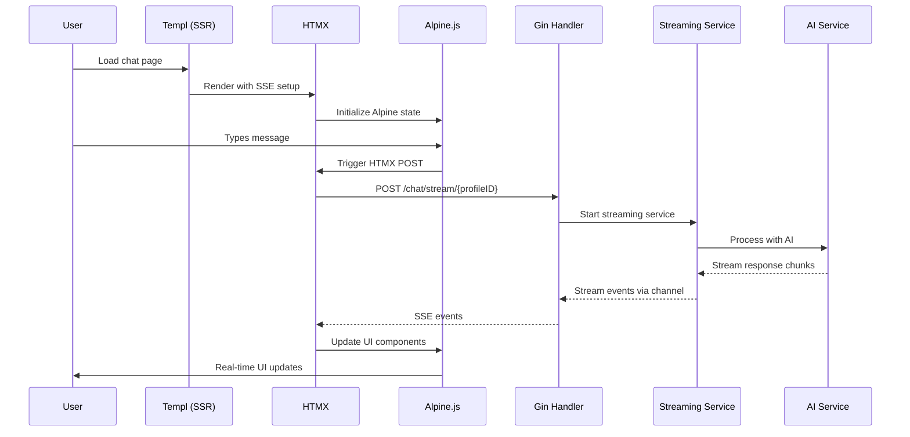

# Loci App Streaming Architecture Documentation
## SSE Streaming with Go/Gin/Templ/HTMX/Alpine.js

This documentation provides a comprehensive guide for implementing Server-Sent Events (SSE) streaming in the Loci application using Go/Gin for backend, Templ for SSR, HTMX for dynamic updates, and Alpine.js for client-side state management.

---

## Table of Contents

1. [Architecture Overview](#architecture-overview)
2. [Server-Side Implementation](#server-side-implementation)
3. [Client-Side Integration](#client-side-integration)
4. [HTMX SSE Patterns](#htmx-sse-patterns)
5. [Alpine.js State Management](#alpinejs-state-management)
6. [Complete Implementation Examples](#complete-implementation-examples)
7. [Error Handling and Resilience](#error-handling-and-resilience)
8. [Performance Considerations](#performance-considerations)
9. [Testing and Debugging](#testing-and-debugging)

---

## Architecture Overview

### Streaming Flow


### Technology Stack Integration
- **Go/Gin**: SSE handlers and API endpoints
- **Templ**: Server-side rendered templates with SSE setup
- **HTMX**: SSE connection management and DOM updates
- **Alpine.js**: Client-side state management and UI coordination

---

## Server-Side Implementation

### 1. Updated SSE Handler (Gin-based)

```go
package handlers

import (
    "context"
    "encoding/json"
    "fmt"
    "net/http"
    "time"

    "github.com/gin-gonic/gin"
    "github.com/google/uuid"
    "go.opentelemetry.io/otel"
    "go.opentelemetry.io/otel/attribute"
    "go.opentelemetry.io/otel/codes"
    "go.opentelemetry.io/otel/trace"
    
    "github.com/FACorreiaa/go-templui/app/lib/models"
    "github.com/FACorreiaa/go-templui/app/pkg/logger"
    "github.com/FACorreiaa/go-templui/app/pkg/middleware"
)

type StreamingChatHandlers struct {
    chatService      LlmInteractionService
    logger           *slog.Logger
}

func NewStreamingChatHandlers(chatService LlmInteractionService, logger *slog.Logger) *StreamingChatHandlers {
    return &StreamingChatHandlers{
        chatService: chatService,
        logger:      logger,
    }
}

// StartChatMessageStream handles SSE streaming for chat messages
func (h *StreamingChatHandlers) StartChatMessageStream(c *gin.Context) {
    ctx, span := otel.Tracer("StreamingChatHandlers").Start(c.Request.Context(), "StartChatMessageStream", trace.WithAttributes(
        attribute.String("http.method", c.Request.Method),
        attribute.String("http.route", "/chat/stream/:profileID"),
    ))
    defer span.End()

    l := h.logger.With("handler", "StartChatMessageStream")
    l.DebugContext(ctx, "Processing unified chat message with streaming")

    // Parse profile ID from URL parameters
    profileIDStr := c.Param("profileID")
    profileID, err := uuid.Parse(profileIDStr)
    if err != nil {
        l.ErrorContext(ctx, "Invalid profile ID", "profileID", profileIDStr, "error", err)
        span.RecordError(err)
        span.SetStatus(codes.Error, "Invalid profile ID")
        c.JSON(http.StatusBadRequest, gin.H{"error": "Invalid profile ID"})
        return
    }

    // Get user ID from middleware context
    userIDStr := middleware.GetUserIDFromContext(c)
    if userIDStr == "" || userIDStr == "anonymous" {
        l.ErrorContext(ctx, "User ID not found in context")
        c.JSON(http.StatusUnauthorized, gin.H{"error": "Authentication required"})
        return
    }
    userID, err := uuid.Parse(userIDStr)
    if err != nil {
        l.ErrorContext(ctx, "Invalid user ID format", "error", err)
        c.JSON(http.StatusBadRequest, gin.H{"error": "Invalid user ID format"})
        return
    }

    // Parse request body
    var req struct {
        Message      string                `json:"message"`
        CityName     string                `json:"city_name,omitempty"`
        UserLocation *models.UserLocation  `json:"user_location,omitempty"`
        SessionID    *string               `json:"session_id,omitempty"`
    }

    if err := c.ShouldBindJSON(&req); err != nil {
        l.ErrorContext(ctx, "Failed to decode request body", "error", err)
        span.RecordError(err)
        span.SetStatus(codes.Error, "Invalid request body")
        c.JSON(http.StatusBadRequest, gin.H{"error": "Invalid request body"})
        return
    }

    // Validate required fields
    if req.Message == "" {
        l.ErrorContext(ctx, "Missing required fields", "message", req.Message)
        span.SetStatus(codes.Error, "Missing required fields")
        c.JSON(http.StatusBadRequest, gin.H{"error": "message is required"})
        return
    }

    span.SetAttributes(
        attribute.String("user.id", userID.String()),
        attribute.String("profile.id", profileID.String()),
        attribute.String("message", req.Message),
        attribute.String("city_name", req.CityName),
    )

    // Set up SSE headers
    c.Header("Content-Type", "text/event-stream")
    c.Header("Cache-Control", "no-cache")
    c.Header("Connection", "keep-alive")
    c.Header("Access-Control-Allow-Origin", "*")
    c.Header("Access-Control-Allow-Headers", "Cache-Control, Content-Type, Authorization")

    // Create event channel with buffer
    eventCh := make(chan models.StreamEvent, 100)
    defer close(eventCh)

    // Start streaming service in goroutine
    go func() {
        defer func() {
            // Ensure channel is closed on service completion
            select {
            case eventCh <- models.StreamEvent{
                Type:      models.EventTypeComplete,
                Timestamp: time.Now(),
                EventID:   uuid.New().String(),
                IsFinal:   true,
            }:
            case <-ctx.Done():
            }
        }()

        l.InfoContext(ctx, "Starting chat message stream",
            "userID", userID.String(),
            "profileID", profileID.String(),
            "cityName", req.CityName,
            "message", req.Message)

        err := h.chatService.ProcessUnifiedChatMessageStream(
            ctx, userID, profileID, req.CityName, req.Message, req.UserLocation, eventCh,
        )
        if err != nil {
            l.ErrorContext(ctx, "Failed to process unified chat message stream", "error", err)
            span.RecordError(err)

            // Send error event if context is still active
            select {
            case eventCh <- models.StreamEvent{
                Type:      models.EventTypeError,
                Error:     err.Error(),
                Timestamp: time.Now(),
                EventID:   uuid.New().String(),
                IsFinal:   true,
            }:
            case <-ctx.Done():
            }
        }
    }()

    // Set up flusher for real-time streaming
    flusher, ok := c.Writer.(http.Flusher)
    if !ok {
        l.ErrorContext(ctx, "Response writer does not support flushing")
        span.SetStatus(codes.Error, "Streaming not supported")
        c.JSON(http.StatusInternalServerError, gin.H{"error": "Streaming not supported"})
        return
    }

    // Send initial connection confirmation
    fmt.Fprintf(c.Writer, "data: %s\n\n", `{"type":"connection","message":"Connected to stream"}`)
    flusher.Flush()

    // Process events in real-time as they arrive
    for {
        select {
        case event, ok := <-eventCh:
            if !ok {
                l.InfoContext(ctx, "Event channel closed, ending stream")
                span.SetStatus(codes.Ok, "Stream completed")
                return
            }

            eventData, err := json.Marshal(event)
            if err != nil {
                l.ErrorContext(ctx, "Failed to marshal event", "error", err)
                span.RecordError(err)
                continue
            }

            // Send SSE formatted event
            fmt.Fprintf(c.Writer, "data: %s\n\n", eventData)
            flusher.Flush()

            // End stream on final events
            if event.IsFinal || event.Type == models.EventTypeComplete || event.Type == models.EventTypeError {
                l.InfoContext(ctx, "Stream completed", "eventType", event.Type)
                span.SetStatus(codes.Ok, "Stream completed")
                return
            }

        case <-c.Request.Context().Done():
            l.InfoContext(ctx, "Client disconnected")
            span.SetStatus(codes.Ok, "Client disconnected")
            return
        }
    }
}

// GetChatPage renders the chat page with SSE setup
func (h *StreamingChatHandlers) GetChatPage(c *gin.Context) {
    user := getUserFromContext(c)
    profileID := c.Param("profileID")
    
    c.HTML(http.StatusOK, "", pages.LayoutPage(models.LayoutTempl{
        Title:   "AI Chat - Loci",
        Content: chat.StreamingChatPage(profileID),
        Nav: models.Navigation{
            Items: []models.NavItem{
                {Name: "Dashboard", URL: "/dashboard"},
                {Name: "Chat", URL: "/chat"},
                {Name: "Nearby", URL: "/nearby"},
            },
        },
        ActiveNav: "Chat",
        User:      user,
    }))
}
```

### 2. Route Configuration

```go
// routes/routes.go
func SetupStreamingRoutes(r *gin.Engine, chatHandlers *handlers.StreamingChatHandlers) {
    // Chat page routes
    protected := r.Group("/")
    protected.Use(middleware.AuthMiddleware())
    {
        // Render chat page
        protected.GET("/chat/:profileID", chatHandlers.GetChatPage)
        
        // SSE streaming endpoint
        protected.POST("/chat/stream/:profileID", chatHandlers.StartChatMessageStream)
    }
    
    // WebSocket alternative (optional)
    r.GET("/ws/chat/:profileID", chatHandlers.HandleWebSocket)
}
```

---

## Client-Side Integration

### 1. Templ Template with SSE Setup

```go
package chat

import (
    "github.com/FACorreiaa/go-templui/app/lib/models"
)

templ StreamingChatPage(profileID string) {
    <div class="streaming-chat-container" x-data="streamingChatController()" x-init="init()">
        <!-- Chat Header -->
        <div class="chat-header">
            <div class="flex items-center gap-3">
                <div class="status-indicator">
                    <div 
                        class="w-3 h-3 rounded-full transition-colors"
                        :class="{
                            'bg-green-500': connectionStatus === 'connected',
                            'bg-yellow-500': connectionStatus === 'connecting',
                            'bg-red-500': connectionStatus === 'disconnected'
                        }"
                    ></div>
                    <span x-text="connectionStatus" class="text-sm text-gray-600"></span>
                </div>
                <h1>AI Chat Assistant</h1>
            </div>
        </div>

        <!-- Messages Container -->
        <div id="chat-messages" class="chat-messages flex-1 overflow-y-auto p-4 space-y-4">
            <!-- Welcome Message -->
            <div class="message ai-message">
                <div class="message-content">
                    <p>Hello! I'm your AI travel assistant. How can I help you plan your next adventure?</p>
                </div>
                <div class="message-timestamp">Just now</div>
            </div>
            
            <!-- Dynamic messages will be added here -->
            <template x-for="message in messages" :key="message.id">
                <div class="message" :class="message.type + '-message'">
                    <div class="message-content">
                        <div x-html="message.content"></div>
                    </div>
                    <div class="message-timestamp" x-text="message.timestamp"></div>
                </div>
            </template>
            
            <!-- Streaming message (AI response in progress) -->
            <div x-show="isStreaming" class="message ai-message streaming">
                <div class="message-content">
                    <div class="streaming-content">
                        <div x-html="streamingContent"></div>
                        <div x-show="isStreaming" class="typing-indicator">
                            <span></span><span></span><span></span>
                        </div>
                    </div>
                </div>
            </div>
        </div>

        <!-- Chat Input -->
        <div class="chat-input-container">
            <form 
                @submit.prevent="sendMessage()"
                class="chat-form"
                x-ref="chatForm"
            >
                <div class="input-group">
                    <textarea
                        x-model="currentMessage"
                        @keydown.enter.prevent="sendMessage()"
                        @keydown.shift.enter="$event.preventDefault(); currentMessage += '\n'"
                        placeholder="Type your message... (Shift+Enter for new line)"
                        class="chat-input"
                        rows="1"
                        :disabled="isStreaming"
                        x-ref="messageInput"
                    ></textarea>
                    
                    <button 
                        type="submit" 
                        :disabled="isStreaming || !currentMessage.trim()"
                        class="send-button"
                    >
                        <span x-show="!isStreaming">Send</span>
                        <span x-show="isStreaming" class="loading-spinner">
                            <div class="spinner"></div>
                        </span>
                    </button>
                </div>
            </form>
            
            <!-- Quick Actions -->
            <div class="quick-actions" x-show="!isStreaming">
                <button @click="sendQuickMessage('Tell me about Paris')" class="quick-action">
                    🇫🇷 Paris Info
                </button>
                <button @click="sendQuickMessage('Plan a 3-day trip to Tokyo')" class="quick-action">
                    🇯🇵 Tokyo Itinerary
                </button>
                <button @click="sendQuickMessage('Find restaurants in New York')" class="quick-action">
                    🗽 NYC Restaurants
                </button>
            </div>
        </div>

        <!-- SSE Connection -->
        <div 
            x-ref="sseContainer"
            style="display: none;"
        ></div>
    </div>

    <!-- Styles -->
    <style>
        .streaming-chat-container {
            display: flex;
            flex-direction: column;
            height: 100vh;
            max-height: 600px;
            background: white;
            border-radius: 8px;
            box-shadow: 0 4px 6px rgba(0, 0, 0, 0.1);
        }

        .chat-header {
            padding: 1rem;
            border-bottom: 1px solid #e5e7eb;
            background: #f9fafb;
        }

        .status-indicator {
            display: flex;
            align-items: center;
            gap: 0.5rem;
        }

        .chat-messages {
            flex: 1;
            overflow-y: auto;
            padding: 1rem;
            space-y: 1rem;
        }

        .message {
            display: flex;
            flex-direction: column;
            margin-bottom: 1rem;
        }

        .user-message {
            align-items: flex-end;
        }

        .ai-message {
            align-items: flex-start;
        }

        .message-content {
            max-width: 80%;
            padding: 0.75rem 1rem;
            border-radius: 1rem;
            background: #f3f4f6;
        }

        .user-message .message-content {
            background: #3b82f6;
            color: white;
            border-bottom-right-radius: 0.25rem;
        }

        .ai-message .message-content {
            background: #f3f4f6;
            color: #1f2937;
            border-bottom-left-radius: 0.25rem;
        }

        .streaming .message-content {
            background: #fef3c7;
            border: 1px solid #f59e0b;
        }

        .message-timestamp {
            font-size: 0.75rem;
            color: #6b7280;
            margin-top: 0.25rem;
            padding: 0 1rem;
        }

        .typing-indicator {
            display: flex;
            gap: 0.25rem;
            margin-left: 0.5rem;
            align-items: center;
        }

        .typing-indicator span {
            width: 0.5rem;
            height: 0.5rem;
            background: #6b7280;
            border-radius: 50%;
            animation: typing 1.4s infinite ease-in-out;
        }

        .typing-indicator span:nth-child(2) {
            animation-delay: 0.2s;
        }

        .typing-indicator span:nth-child(3) {
            animation-delay: 0.4s;
        }

        @keyframes typing {
            0%, 80%, 100% { opacity: 0.3; transform: scale(0.8); }
            40% { opacity: 1; transform: scale(1); }
        }

        .chat-input-container {
            padding: 1rem;
            border-top: 1px solid #e5e7eb;
            background: white;
        }

        .input-group {
            display: flex;
            gap: 0.75rem;
            align-items: flex-end;
        }

        .chat-input {
            flex: 1;
            padding: 0.75rem;
            border: 2px solid #e5e7eb;
            border-radius: 0.5rem;
            resize: none;
            max-height: 120px;
            font-family: inherit;
        }

        .chat-input:focus {
            outline: none;
            border-color: #3b82f6;
            box-shadow: 0 0 0 3px rgba(59, 130, 246, 0.1);
        }

        .send-button {
            padding: 0.75rem 1.5rem;
            background: #3b82f6;
            color: white;
            border: none;
            border-radius: 0.5rem;
            cursor: pointer;
            transition: background-color 0.2s;
            min-width: 80px;
        }

        .send-button:hover:not(:disabled) {
            background: #2563eb;
        }

        .send-button:disabled {
            background: #9ca3af;
            cursor: not-allowed;
        }

        .quick-actions {
            display: flex;
            gap: 0.5rem;
            margin-top: 0.75rem;
            flex-wrap: wrap;
        }

        .quick-action {
            padding: 0.5rem 0.75rem;
            background: #f3f4f6;
            border: 1px solid #d1d5db;
            border-radius: 0.375rem;
            font-size: 0.875rem;
            cursor: pointer;
            transition: background-color 0.2s;
        }

        .quick-action:hover {
            background: #e5e7eb;
        }

        .loading-spinner {
            display: flex;
            justify-content: center;
            align-items: center;
        }

        .spinner {
            width: 1rem;
            height: 1rem;
            border: 2px solid transparent;
            border-top: 2px solid currentColor;
            border-radius: 50%;
            animation: spin 1s linear infinite;
        }

        @keyframes spin {
            to { transform: rotate(360deg); }
        }
    </style>

    <!-- JavaScript Controller -->
    <script>
        function streamingChatController() {
            return {
                // State
                profileID: "{profileID}",
                messages: [],
                currentMessage: '',
                streamingContent: '',
                isStreaming: false,
                connectionStatus: 'disconnected',
                eventSource: null,
                messageIdCounter: 0,
                
                // Initialization
                init() {
                    console.log('Initializing streaming chat controller');
                    this.setupEventSource();
                    this.setupAutoResize();
                },
                
                // SSE Connection Management
                setupEventSource() {
                    // Note: We don't establish SSE connection until we send a message
                    this.connectionStatus = 'disconnected';
                },
                
                connectToStream(message, additionalData = {}) {
                    if (this.eventSource) {
                        this.eventSource.close();
                    }
                    
                    this.connectionStatus = 'connecting';
                    this.isStreaming = true;
                    this.streamingContent = '';
                    
                    // First, send the message via fetch to start the stream
                    const requestBody = {
                        message: message,
                        city_name: additionalData.cityName || '',
                        user_location: additionalData.userLocation || null,
                        session_id: additionalData.sessionId || null
                    };
                    
                    fetch(`/chat/stream/${this.profileID}`, {
                        method: 'POST',
                        headers: {
                            'Content-Type': 'application/json',
                            'Accept': 'text/event-stream',
                        },
                        body: JSON.stringify(requestBody)
                    })
                    .then(response => {
                        if (!response.ok) {
                            throw new Error(`HTTP error! status: ${response.status}`);
                        }
                        
                        this.connectionStatus = 'connected';
                        
                        // Read the stream
                        const reader = response.body.getReader();
                        const decoder = new TextDecoder();
                        
                        const readStream = () => {
                            reader.read().then(({ done, value }) => {
                                if (done) {
                                    this.handleStreamEnd();
                                    return;
                                }
                                
                                // Decode chunk
                                const chunk = decoder.decode(value, { stream: true });
                                this.processStreamChunk(chunk);
                                
                                // Continue reading
                                readStream();
                            }).catch(error => {
                                console.error('Stream reading error:', error);
                                this.handleStreamError(error);
                            });
                        };
                        
                        readStream();
                    })
                    .catch(error => {
                        console.error('Failed to start stream:', error);
                        this.handleStreamError(error);
                    });
                },
                
                processStreamChunk(chunk) {
                    // Split chunk by lines and process each SSE event
                    const lines = chunk.split('\n');
                    
                    for (const line of lines) {
                        if (line.startsWith('data: ')) {
                            try {
                                const eventData = JSON.parse(line.slice(6));
                                this.handleStreamEvent(eventData);
                            } catch (error) {
                                console.error('Failed to parse SSE data:', error, line);
                            }
                        }
                    }
                },
                
                handleStreamEvent(event) {
                    console.log('Received stream event:', event);
                    
                    switch (event.type) {
                        case 'connection':
                            this.connectionStatus = 'connected';
                            break;
                            
                        case 'start':
                            // Stream started
                            this.streamingContent = '';
                            break;
                            
                        case 'chunk':
                            // Append text chunk to streaming content
                            this.streamingContent += event.message || '';
                            this.scrollToBottom();
                            break;
                            
                        case 'city_data':
                            // Handle city data event
                            if (event.data) {
                                this.streamingContent += `\n\n**City Information: ${event.data.city}**\n${event.data.description}\n`;
                            }
                            break;
                            
                        case 'general_poi':
                        case 'personalized_poi':
                            // Handle POI data
                            if (event.data && Array.isArray(event.data)) {
                                this.streamingContent += '\n\n**Recommendations:**\n';
                                event.data.forEach(poi => {
                                    this.streamingContent += `• **${poi.name}** - ${poi.description}\n`;
                                });
                            }
                            break;
                            
                        case 'itinerary':
                            // Handle final itinerary
                            if (event.data) {
                                this.streamingContent += '\n\n**Complete Itinerary:**\n' + event.data.overall_description;
                            }
                            break;
                            
                        case 'complete':
                            // Stream completed successfully
                            this.handleStreamComplete();
                            break;
                            
                        case 'error':
                            // Handle error
                            this.handleStreamError({ message: event.error || 'Unknown error occurred' });
                            break;
                            
                        default:
                            console.warn('Unknown event type:', event.type);
                    }
                },
                
                handleStreamComplete() {
                    console.log('Stream completed successfully');
                    
                    // Add the completed streaming content as a message
                    if (this.streamingContent.trim()) {
                        this.messages.push({
                            id: this.generateMessageId(),
                            type: 'ai',
                            content: this.formatMessageContent(this.streamingContent),
                            timestamp: this.formatTimestamp(new Date())
                        });
                    }
                    
                    // Reset streaming state
                    this.isStreaming = false;
                    this.streamingContent = '';
                    this.connectionStatus = 'disconnected';
                    
                    this.scrollToBottom();
                },
                
                handleStreamError(error) {
                    console.error('Stream error:', error);
                    
                    // Add error message
                    this.messages.push({
                        id: this.generateMessageId(),
                        type: 'error',
                        content: `<div class="error-message">Sorry, there was an error processing your request: ${error.message}</div>`,
                        timestamp: this.formatTimestamp(new Date())
                    });
                    
                    // Reset streaming state
                    this.isStreaming = false;
                    this.streamingContent = '';
                    this.connectionStatus = 'disconnected';
                    
                    this.scrollToBottom();
                },
                
                handleStreamEnd() {
                    console.log('Stream ended');
                    this.handleStreamComplete();
                },
                
                // Message Management
                sendMessage() {
                    const message = this.currentMessage.trim();
                    if (!message || this.isStreaming) return;
                    
                    // Add user message to chat
                    this.messages.push({
                        id: this.generateMessageId(),
                        type: 'user',
                        content: this.formatMessageContent(message),
                        timestamp: this.formatTimestamp(new Date())
                    });
                    
                    // Clear input
                    this.currentMessage = '';
                    
                    // Start streaming response
                    this.connectToStream(message);
                    
                    // Auto-resize textarea
                    this.$refs.messageInput.style.height = 'auto';
                    
                    this.scrollToBottom();
                },
                
                sendQuickMessage(message) {
                    this.currentMessage = message;
                    this.sendMessage();
                },
                
                // Utility Functions
                generateMessageId() {
                    return `msg_${++this.messageIdCounter}_${Date.now()}`;
                },
                
                formatTimestamp(date) {
                    return date.toLocaleTimeString([], { hour: '2-digit', minute: '2-digit' });
                },
                
                formatMessageContent(content) {
                    // Convert markdown-like syntax to HTML
                    return content
                        .replace(/\*\*(.*?)\*\*/g, '<strong>$1</strong>')
                        .replace(/\*(.*?)\*/g, '<em>$1</em>')
                        .replace(/\n/g, '<br>');
                },
                
                scrollToBottom() {
                    this.$nextTick(() => {
                        const messagesContainer = document.getElementById('chat-messages');
                        if (messagesContainer) {
                            messagesContainer.scrollTop = messagesContainer.scrollHeight;
                        }
                    });
                },
                
                setupAutoResize() {
                    this.$watch('currentMessage', () => {
                        this.$nextTick(() => {
                            const textarea = this.$refs.messageInput;
                            if (textarea) {
                                textarea.style.height = 'auto';
                                textarea.style.height = Math.min(textarea.scrollHeight, 120) + 'px';
                            }
                        });
                    });
                }
            }
        }
    </script>
}
```

---

## HTMX SSE Patterns

### 1. Alternative HTMX-Based Approach

If you prefer to use HTMX's built-in SSE extension instead of custom JavaScript:

```go
templ HTMXStreamingChatPage(profileID string) {
    <div class="chat-container" x-data="htmxChatController()">
        <!-- Messages Container -->
        <div id="chat-messages" class="messages-container">
            <!-- Existing messages -->
        </div>
        
        <!-- Chat Input -->
        <form 
            hx-post="/chat/initiate/{profileID}"
            hx-trigger="submit"
            hx-target="#streaming-status"
            hx-swap="innerHTML"
            @submit.prevent="initializeStream($event)"
        >
            <input name="message" x-model="currentMessage" />
            <button type="submit">Send</button>
        </form>
        
        <!-- Streaming Status -->
        <div id="streaming-status"></div>
        
        <!-- SSE Connection (activated after message sent) -->
        <div 
            id="sse-container"
            hx-ext="sse"
            style="display: none;"
        >
            <!-- This will be populated dynamically -->
        </div>
    </div>

    <script>
    function htmxChatController() {
        return {
            currentMessage: '',
            streamingActive: false,
            
            initializeStream(event) {
                event.preventDefault();
                
                const message = this.currentMessage.trim();
                if (!message) return;
                
                // Add user message to chat
                this.addUserMessage(message);
                
                // Clear input
                this.currentMessage = '';
                
                // Setup SSE connection with HTMX
                const sseContainer = document.getElementById('sse-container');
                sseContainer.innerHTML = `
                    <div 
                        sse-connect="/chat/stream/{profileID}"
                        sse-swap="message:#chat-messages:beforeend"
                        sse-swap="complete:#streaming-status"
                        sse-swap="error:#streaming-status"
                        hx-trigger="sse:open"
                        hx-post="/chat/send/{profileID}"
                        hx-vals='{"message": "${message}"}'
                    ></div>
                `;
                
                // Initialize HTMX on the new element
                htmx.process(sseContainer);
            },
            
            addUserMessage(message) {
                const messagesContainer = document.getElementById('chat-messages');
                const messageElement = document.createElement('div');
                messageElement.className = 'message user-message';
                messageElement.innerHTML = `
                    <div class="message-content">${message}</div>
                    <div class="message-timestamp">${new Date().toLocaleTimeString()}</div>
                `;
                messagesContainer.appendChild(messageElement);
            }
        }
    }
    </script>
}
```

### 2. Hybrid Approach with HTMX Events

```go
templ HybridStreamingChat(profileID string) {
    <div 
        class="hybrid-chat" 
        x-data="hybridChatController()"
        hx-ext="sse"
        @htmx:sse-open="handleSSEOpen($event)"
        @htmx:sse-close="handleSSEClose($event)"
        @htmx:sse-error="handleSSEError($event)"
    >
        <!-- Chat Interface -->
        <div id="chat-messages"></div>
        
        <!-- Input Form -->
        <form 
            hx-post="/chat/start-stream/{profileID}"
            hx-trigger="submit"
            hx-target="this"
            hx-swap="none"
            @htmx:after-request="handleStreamInitiated($event)"
        >
            <input name="message" x-model="currentMessage" />
            <button type="submit" :disabled="isStreaming">
                <span x-text="isStreaming ? 'Streaming...' : 'Send'"></span>
            </button>
        </form>
        
        <!-- SSE Connection (dynamic) -->
        <div id="sse-connection"></div>
    </div>

    <script>
    function hybridChatController() {
        return {
            currentMessage: '',
            isStreaming: false,
            messages: [],
            
            handleStreamInitiated(event) {
                if (event.detail.xhr.status === 200) {
                    // Successful stream initiation
                    const response = JSON.parse(event.detail.xhr.response);
                    this.setupSSEConnection(response.stream_id);
                }
            },
            
            setupSSEConnection(streamId) {
                this.isStreaming = true;
                
                // Create SSE connection element
                const sseElement = document.createElement('div');
                sseElement.setAttribute('sse-connect', `/chat/stream/{profileID}?stream_id=${streamId}`);
                sseElement.setAttribute('sse-swap', 'message');
                sseElement.setAttribute('hx-target', '#chat-messages');
                sseElement.setAttribute('hx-swap', 'beforeend');
                
                document.getElementById('sse-connection').appendChild(sseElement);
                htmx.process(sseElement);
            },
            
            handleSSEOpen(event) {
                console.log('SSE connection opened');
            },
            
            handleSSEClose(event) {
                console.log('SSE connection closed');
                this.isStreaming = false;
            },
            
            handleSSEError(event) {
                console.error('SSE error:', event);
                this.isStreaming = false;
            }
        }
    }
    </script>
}
```

---

## Alpine.js State Management

### 1. Global Chat State Store

```go
templ ChatWithGlobalState() {
    <div x-data="chatController()">
        <!-- Chat Interface -->
    </div>

    <script>
    // Global Alpine.js store for chat state
    document.addEventListener('alpine:init', () => {
        Alpine.store('chatState', {
            // State
            sessions: {},
            activeSessionId: null,
            connectionStatus: 'disconnected',
            streamingStates: {},
            
            // Methods
            createSession(profileId) {
                const sessionId = `session_${Date.now()}_${Math.random().toString(36).substr(2, 9)}`;
                this.sessions[sessionId] = {
                    id: sessionId,
                    profileId: profileId,
                    messages: [],
                    createdAt: new Date(),
                    isActive: true
                };
                this.activeSessionId = sessionId;
                return sessionId;
            },
            
            addMessage(sessionId, message) {
                if (this.sessions[sessionId]) {
                    this.sessions[sessionId].messages.push({
                        ...message,
                        id: `msg_${Date.now()}_${Math.random().toString(36).substr(2, 9)}`,
                        timestamp: new Date()
                    });
                }
            },
            
            setStreamingState(sessionId, isStreaming, content = '') {
                this.streamingStates[sessionId] = {
                    isStreaming: isStreaming,
                    content: content,
                    updatedAt: new Date()
                };
            },
            
            getSession(sessionId) {
                return this.sessions[sessionId] || null;
            },
            
            getActiveSession() {
                return this.activeSessionId ? this.sessions[this.activeSessionId] : null;
            }
        });
    });

    function chatController() {
        return {
            profileId: '{profileID}',
            currentMessage: '',
            
            get session() {
                return this.$store.chatState.getActiveSession();
            },
            
            get messages() {
                const session = this.session;
                return session ? session.messages : [];
            },
            
            get streamingState() {
                const sessionId = this.session?.id;
                return sessionId ? this.$store.chatState.streamingStates[sessionId] : null;
            },
            
            get isStreaming() {
                return this.streamingState?.isStreaming || false;
            },
            
            init() {
                // Create session if none exists
                if (!this.session) {
                    this.$store.chatState.createSession(this.profileId);
                }
            },
            
            async sendMessage() {
                const message = this.currentMessage.trim();
                if (!message || this.isStreaming) return;
                
                const sessionId = this.session.id;
                
                // Add user message
                this.$store.chatState.addMessage(sessionId, {
                    type: 'user',
                    content: message,
                    sender: 'user'
                });
                
                // Clear input
                this.currentMessage = '';
                
                // Start streaming
                this.$store.chatState.setStreamingState(sessionId, true);
                
                try {
                    const response = await fetch(`/chat/stream/${this.profileId}`, {
                        method: 'POST',
                        headers: {
                            'Content-Type': 'application/json',
                        },
                        body: JSON.stringify({
                            message: message,
                            session_id: sessionId
                        })
                    });
                    
                    if (!response.ok) {
                        throw new Error(`HTTP error! status: ${response.status}`);
                    }
                    
                    // Read stream
                    await this.readStreamResponse(response, sessionId);
                    
                } catch (error) {
                    console.error('Failed to send message:', error);
                    this.$store.chatState.addMessage(sessionId, {
                        type: 'error',
                        content: `Error: ${error.message}`,
                        sender: 'system'
                    });
                } finally {
                    this.$store.chatState.setStreamingState(sessionId, false);
                }
            },
            
            async readStreamResponse(response, sessionId) {
                const reader = response.body.getReader();
                const decoder = new TextDecoder();
                let streamingContent = '';
                
                while (true) {
                    const { done, value } = await reader.read();
                    
                    if (done) break;
                    
                    const chunk = decoder.decode(value, { stream: true });
                    const lines = chunk.split('\n');
                    
                    for (const line of lines) {
                        if (line.startsWith('data: ')) {
                            try {
                                const eventData = JSON.parse(line.slice(6));
                                
                                if (eventData.type === 'chunk') {
                                    streamingContent += eventData.message || '';
                                    this.$store.chatState.setStreamingState(sessionId, true, streamingContent);
                                } else if (eventData.type === 'complete') {
                                    // Add final message
                                    this.$store.chatState.addMessage(sessionId, {
                                        type: 'ai',
                                        content: streamingContent,
                                        sender: 'assistant'
                                    });
                                    return; // Exit the loop
                                } else if (eventData.type === 'error') {
                                    throw new Error(eventData.error || 'Stream error');
                                }
                            } catch (parseError) {
                                console.error('Failed to parse SSE data:', parseError);
                            }
                        }
                    }
                }
            }
        }
    }
    </script>
}
```

---

## Complete Implementation Examples

### 1. Full Integration Example

Here's a complete example showing how all pieces work together:

```go
// Handler
func (h *StreamingChatHandlers) SetupCompleteStreaming(r *gin.Engine) {
    // Page route
    r.GET("/chat/:profileID", h.GetChatPage)
    
    // Streaming endpoint
    r.POST("/chat/stream/:profileID", h.StartChatMessageStream)
    
    // Health check for streaming
    r.GET("/chat/health/:profileID", h.HealthCheck)
}

func (h *StreamingChatHandlers) HealthCheck(c *gin.Context) {
    c.JSON(200, gin.H{
        "status": "ok",
        "streaming": "available",
        "timestamp": time.Now().Unix(),
    })
}
```

```go
// Templ Template
templ CompleteStreamingExample(profileID string) {
    <div 
        class="complete-streaming-chat" 
        x-data="completeStreamingController()"
        x-init="initialize()"
    >
        <!-- Connection Status -->
        <div class="connection-status">
            <div class="status-indicator" :class="connectionClass">
                <span x-text="connectionStatus"></span>
            </div>
            <button @click="testConnection()" class="test-btn">Test Connection</button>
        </div>
        
        <!-- Messages -->
        <div id="messages-container" class="messages-container">
            <template x-for="message in messages" :key="message.id">
                <div class="message" :class="`message-${message.type}`">
                    <div class="message-content" x-html="message.content"></div>
                    <div class="message-meta">
                        <span x-text="message.timestamp"></span>
                        <span x-show="message.type === 'ai' && message.tokens" 
                              x-text="`${message.tokens} tokens`" 
                              class="token-count"></span>
                    </div>
                </div>
            </template>
            
            <!-- Streaming message -->
            <div x-show="isStreaming" class="message message-ai streaming">
                <div class="message-content">
                    <div x-html="streamingContent"></div>
                    <div class="typing-indicator" x-show="isStreaming">
                        <span></span><span></span><span></span>
                    </div>
                </div>
            </div>
        </div>
        
        <!-- Input Form -->
        <form @submit.prevent="sendMessage()" class="message-form">
            <div class="input-group">
                <textarea 
                    x-model="currentMessage"
                    @keydown.enter.prevent="handleEnterKey($event)"
                    placeholder="Type your message..."
                    class="message-input"
                    :disabled="isStreaming"
                ></textarea>
                
                <button 
                    type="submit" 
                    :disabled="!canSend"
                    class="send-button"
                    :class="{ 'sending': isStreaming }"
                >
                    <span x-show="!isStreaming">Send</span>
                    <span x-show="isStreaming">
                        <div class="spinner"></div>
                    </span>
                </button>
            </div>
            
            <!-- Additional Options -->
            <div class="message-options" x-show="!isStreaming">
                <label class="option-item">
                    <input type="checkbox" x-model="includeLocation" />
                    Include my location
                </label>
                
                <select x-model="selectedCity" class="city-select">
                    <option value="">Select city context</option>
                    <option value="paris">Paris</option>
                    <option value="tokyo">Tokyo</option>
                    <option value="newyork">New York</option>
                </select>
            </div>
        </form>
        
        <!-- Debug Panel (development only) -->
        <div x-show="debugMode" class="debug-panel">
            <h3>Debug Information</h3>
            <pre x-text="JSON.stringify(debugInfo, null, 2)"></pre>
        </div>
    </div>

    <script>
    function completeStreamingController() {
        return {
            // Configuration
            profileID: '{profileID}',
            apiBaseUrl: '/chat',
            
            // State
            messages: [],
            currentMessage: '',
            streamingContent: '',
            isStreaming: false,
            connectionStatus: 'disconnected',
            includeLocation: false,
            selectedCity: '',
            userLocation: null,
            debugMode: false,
            debugInfo: {},
            
            // Computed properties
            get connectionClass() {
                return {
                    'status-connected': this.connectionStatus === 'connected',
                    'status-connecting': this.connectionStatus === 'connecting',
                    'status-disconnected': this.connectionStatus === 'disconnected',
                    'status-error': this.connectionStatus === 'error'
                };
            },
            
            get canSend() {
                return this.currentMessage.trim() && !this.isStreaming && this.connectionStatus !== 'error';
            },
            
            // Initialization
            async initialize() {
                console.log('Initializing complete streaming controller');
                
                // Test connection
                await this.testConnection();
                
                // Get user location if allowed
                if (this.includeLocation) {
                    await this.getUserLocation();
                }
                
                // Enable debug mode in development
                if (window.location.hostname === 'localhost') {
                    this.debugMode = true;
                }
            },
            
            // Connection Management
            async testConnection() {
                try {
                    this.connectionStatus = 'connecting';
                    
                    const response = await fetch(`${this.apiBaseUrl}/health/${this.profileID}`);
                    const data = await response.json();
                    
                    if (data.status === 'ok') {
                        this.connectionStatus = 'connected';
                        this.debugInfo.lastHealthCheck = data;
                    } else {
                        this.connectionStatus = 'error';
                    }
                } catch (error) {
                    console.error('Connection test failed:', error);
                    this.connectionStatus = 'error';
                    this.debugInfo.lastError = error.message;
                }
            },
            
            // Location Services
            async getUserLocation() {
                if (!navigator.geolocation) {
                    console.warn('Geolocation not supported');
                    return;
                }
                
                return new Promise((resolve) => {
                    navigator.geolocation.getCurrentPosition(
                        (position) => {
                            this.userLocation = {
                                latitude: position.coords.latitude,
                                longitude: position.coords.longitude,
                                accuracy: position.coords.accuracy
                            };
                            this.debugInfo.userLocation = this.userLocation;
                            resolve(this.userLocation);
                        },
                        (error) => {
                            console.error('Geolocation error:', error);
                            resolve(null);
                        }
                    );
                });
            },
            
            // Message Handling
            async sendMessage() {
                const message = this.currentMessage.trim();
                if (!this.canSend) return;
                
                // Add user message
                this.addMessage({
                    type: 'user',
                    content: this.escapeHtml(message),
                    timestamp: this.formatTimestamp(new Date())
                });
                
                // Clear input
                const originalMessage = message;
                this.currentMessage = '';
                
                // Prepare request data
                const requestData = {
                    message: originalMessage,
                    city_name: this.selectedCity,
                    user_location: this.includeLocation ? this.userLocation : null
                };
                
                this.debugInfo.lastRequest = requestData;
                
                // Start streaming
                await this.startStream(requestData);
            },
            
            async startStream(requestData) {
                this.isStreaming = true;
                this.streamingContent = '';
                this.connectionStatus = 'connecting';
                
                try {
                    const response = await fetch(`${this.apiBaseUrl}/stream/${this.profileID}`, {
                        method: 'POST',
                        headers: {
                            'Content-Type': 'application/json',
                            'Accept': 'text/event-stream',
                        },
                        body: JSON.stringify(requestData)
                    });
                    
                    if (!response.ok) {
                        throw new Error(`HTTP ${response.status}: ${response.statusText}`);
                    }
                    
                    this.connectionStatus = 'connected';
                    await this.processStream(response);
                    
                } catch (error) {
                    console.error('Streaming failed:', error);
                    this.handleStreamError(error);
                }
            },
            
            async processStream(response) {
                const reader = response.body.getReader();
                const decoder = new TextDecoder();
                let buffer = '';
                
                try {
                    while (true) {
                        const { done, value } = await reader.read();
                        
                        if (done) {
                            this.handleStreamComplete();
                            break;
                        }
                        
                        buffer += decoder.decode(value, { stream: true });
                        
                        // Process complete lines
                        const lines = buffer.split('\n');
                        buffer = lines.pop() || ''; // Keep incomplete line in buffer
                        
                        for (const line of lines) {
                            if (line.startsWith('data: ')) {
                                await this.processStreamEvent(line.slice(6));
                            }
                        }
                    }
                } catch (error) {
                    console.error('Stream processing error:', error);
                    this.handleStreamError(error);
                }
            },
            
            async processStreamEvent(eventDataStr) {
                try {
                    const eventData = JSON.parse(eventDataStr);
                    this.debugInfo.lastEvent = eventData;
                    
                    switch (eventData.type) {
                        case 'connection':
                            console.log('Stream connected');
                            break;
                            
                        case 'start':
                            this.streamingContent = '';
                            break;
                            
                        case 'chunk':
                            this.streamingContent += eventData.message || '';
                            this.scrollToBottom();
                            break;
                            
                        case 'city_data':
                            this.handleCityData(eventData.data);
                            break;
                            
                        case 'general_poi':
                        case 'personalized_poi':
                            this.handlePOIData(eventData.data);
                            break;
                            
                        case 'itinerary':
                            this.handleItineraryData(eventData.data);
                            break;
                            
                        case 'complete':
                            this.handleStreamComplete();
                            return;
                            
                        case 'error':
                            this.handleStreamError(new Error(eventData.error || 'Stream error'));
                            return;
                            
                        default:
                            console.warn('Unknown event type:', eventData.type);
                    }
                } catch (error) {
                    console.error('Failed to process stream event:', error);
                }
            },
            
            handleCityData(cityData) {
                if (cityData) {
                    this.streamingContent += `\n\n**${cityData.city}, ${cityData.country}**\n${cityData.description}\n`;
                    this.scrollToBottom();
                }
            },
            
            handlePOIData(pois) {
                if (pois && Array.isArray(pois)) {
                    this.streamingContent += '\n\n**Recommendations:**\n';
                    pois.forEach(poi => {
                        this.streamingContent += `• **${poi.name}** - ${poi.description}\n`;
                    });
                    this.scrollToBottom();
                }
            },
            
            handleItineraryData(itinerary) {
                if (itinerary) {
                    this.streamingContent += '\n\n**Your Personalized Itinerary:**\n';
                    this.streamingContent += itinerary.overall_description || 'Itinerary details...';
                    this.scrollToBottom();
                }
            },
            
            handleStreamComplete() {
                console.log('Stream completed successfully');
                
                if (this.streamingContent.trim()) {
                    this.addMessage({
                        type: 'ai',
                        content: this.formatStreamingContent(this.streamingContent),
                        timestamp: this.formatTimestamp(new Date()),
                        tokens: this.estimateTokens(this.streamingContent)
                    });
                }
                
                this.isStreaming = false;
                this.streamingContent = '';
                this.connectionStatus = 'connected';
                this.scrollToBottom();
            },
            
            handleStreamError(error) {
                console.error('Stream error:', error);
                
                this.addMessage({
                    type: 'error',
                    content: `<div class="error-message">
                        <strong>Error:</strong> ${this.escapeHtml(error.message)}
                        <br><small>Please try again or contact support if the problem persists.</small>
                    </div>`,
                    timestamp: this.formatTimestamp(new Date())
                });
                
                this.isStreaming = false;
                this.streamingContent = '';
                this.connectionStatus = 'error';
                this.debugInfo.lastError = error;
                this.scrollToBottom();
            },
            
            // Utility Functions
            addMessage(message) {
                this.messages.push({
                    ...message,
                    id: this.generateMessageId()
                });
                this.scrollToBottom();
            },
            
            generateMessageId() {
                return `msg_${Date.now()}_${Math.random().toString(36).substr(2, 9)}`;
            },
            
            formatTimestamp(date) {
                return date.toLocaleTimeString([], { hour: '2-digit', minute: '2-digit' });
            },
            
            formatStreamingContent(content) {
                return content
                    .replace(/\*\*(.*?)\*\*/g, '<strong>$1</strong>')
                    .replace(/\*(.*?)\*/g, '<em>$1</em>')
                    .replace(/\n/g, '<br>');
            },
            
            escapeHtml(text) {
                const div = document.createElement('div');
                div.textContent = text;
                return div.innerHTML;
            },
            
            estimateTokens(text) {
                // Rough estimation: ~4 characters per token
                return Math.ceil(text.length / 4);
            },
            
            scrollToBottom() {
                this.$nextTick(() => {
                    const container = document.getElementById('messages-container');
                    if (container) {
                        container.scrollTop = container.scrollHeight;
                    }
                });
            },
            
            handleEnterKey(event) {
                if (event.shiftKey) {
                    // Allow new line with Shift+Enter
                    return;
                } else {
                    // Send message with Enter
                    event.preventDefault();
                    this.sendMessage();
                }
            }
        }
    }
    </script>

    <!-- Styles -->
    <style>
        .complete-streaming-chat {
            display: flex;
            flex-direction: column;
            height: 600px;
            max-width: 800px;
            margin: 0 auto;
            border: 1px solid #e5e7eb;
            border-radius: 8px;
            background: white;
            overflow: hidden;
        }

        .connection-status {
            display: flex;
            align-items: center;
            justify-content: space-between;
            padding: 0.75rem 1rem;
            background: #f9fafb;
            border-bottom: 1px solid #e5e7eb;
            font-size: 0.875rem;
        }

        .status-indicator {
            display: flex;
            align-items: center;
            gap: 0.5rem;
        }

        .status-indicator::before {
            content: '';
            width: 8px;
            height: 8px;
            border-radius: 50%;
            background: #6b7280;
        }

        .status-connected::before { background: #10b981; }
        .status-connecting::before { background: #f59e0b; animation: pulse 2s infinite; }
        .status-disconnected::before { background: #6b7280; }
        .status-error::before { background: #ef4444; }

        @keyframes pulse {
            0%, 100% { opacity: 1; }
            50% { opacity: 0.5; }
        }

        .test-btn {
            padding: 0.25rem 0.75rem;
            background: #3b82f6;
            color: white;
            border: none;
            border-radius: 4px;
            font-size: 0.75rem;
            cursor: pointer;
        }

        .messages-container {
            flex: 1;
            overflow-y: auto;
            padding: 1rem;
            display: flex;
            flex-direction: column;
            gap: 1rem;
        }

        .message {
            display: flex;
            flex-direction: column;
            max-width: 80%;
        }

        .message-user {
            align-self: flex-end;
            align-items: flex-end;
        }

        .message-ai {
            align-self: flex-start;
            align-items: flex-start;
        }

        .message-error {
            align-self: center;
            align-items: center;
            max-width: 100%;
        }

        .message-content {
            padding: 0.75rem 1rem;
            border-radius: 1rem;
            background: #f3f4f6;
            color: #1f2937;
            line-height: 1.5;
        }

        .message-user .message-content {
            background: #3b82f6;
            color: white;
            border-bottom-right-radius: 0.25rem;
        }

        .message-ai .message-content {
            border-bottom-left-radius: 0.25rem;
        }

        .message-error .message-content {
            background: #fef2f2;
            color: #dc2626;
            border: 1px solid #fecaca;
        }

        .streaming .message-content {
            background: linear-gradient(90deg, #fef3c7, #fde68a);
            border: 1px solid #f59e0b;
        }

        .message-meta {
            display: flex;
            justify-content: space-between;
            align-items: center;
            font-size: 0.75rem;
            color: #6b7280;
            margin-top: 0.25rem;
            padding: 0 0.5rem;
        }

        .token-count {
            font-style: italic;
        }

        .typing-indicator {
            display: flex;
            gap: 0.25rem;
            margin-top: 0.5rem;
        }

        .typing-indicator span {
            width: 6px;
            height: 6px;
            background: #6b7280;
            border-radius: 50%;
            animation: typing 1.4s infinite ease-in-out;
        }

        .typing-indicator span:nth-child(2) { animation-delay: 0.2s; }
        .typing-indicator span:nth-child(3) { animation-delay: 0.4s; }

        @keyframes typing {
            0%, 80%, 100% { opacity: 0.3; transform: scale(0.8); }
            40% { opacity: 1; transform: scale(1); }
        }

        .message-form {
            padding: 1rem;
            border-top: 1px solid #e5e7eb;
            background: #f9fafb;
        }

        .input-group {
            display: flex;
            gap: 0.75rem;
            align-items: flex-end;
        }

        .message-input {
            flex: 1;
            min-height: 44px;
            max-height: 120px;
            padding: 0.75rem;
            border: 2px solid #e5e7eb;
            border-radius: 0.5rem;
            resize: none;
            font-family: inherit;
            background: white;
        }

        .message-input:focus {
            outline: none;
            border-color: #3b82f6;
            box-shadow: 0 0 0 3px rgba(59, 130, 246, 0.1);
        }

        .send-button {
            min-width: 80px;
            height: 44px;
            padding: 0 1.5rem;
            background: #3b82f6;
            color: white;
            border: none;
            border-radius: 0.5rem;
            cursor: pointer;
            transition: all 0.2s;
            display: flex;
            align-items: center;
            justify-content: center;
        }

        .send-button:hover:not(:disabled) {
            background: #2563eb;
        }

        .send-button:disabled {
            background: #9ca3af;
            cursor: not-allowed;
        }

        .send-button.sending {
            background: #f59e0b;
        }

        .spinner {
            width: 16px;
            height: 16px;
            border: 2px solid transparent;
            border-top: 2px solid currentColor;
            border-radius: 50%;
            animation: spin 1s linear infinite;
        }

        @keyframes spin {
            to { transform: rotate(360deg); }
        }

        .message-options {
            display: flex;
            align-items: center;
            gap: 1rem;
            margin-top: 0.75rem;
            padding-top: 0.75rem;
            border-top: 1px solid #e5e7eb;
        }

        .option-item {
            display: flex;
            align-items: center;
            gap: 0.5rem;
            font-size: 0.875rem;
            color: #4b5563;
            cursor: pointer;
        }

        .city-select {
            padding: 0.5rem;
            border: 1px solid #d1d5db;
            border-radius: 0.375rem;
            font-size: 0.875rem;
            background: white;
        }

        .debug-panel {
            padding: 1rem;
            background: #1f2937;
            color: #f3f4f6;
            font-family: 'Monaco', 'Menlo', 'Ubuntu Mono', monospace;
            font-size: 0.75rem;
            max-height: 200px;
            overflow-y: auto;
        }

        .debug-panel h3 {
            margin: 0 0 0.5rem 0;
            color: #60a5fa;
        }

        .debug-panel pre {
            margin: 0;
            white-space: pre-wrap;
            word-break: break-all;
        }

        .error-message {
            padding: 0.75rem;
            background: #fef2f2;
            border: 1px solid #fecaca;
            border-radius: 0.5rem;
            color: #dc2626;
        }

        .error-message strong {
            color: #991b1b;
        }
    </style>
}
```

---

## Error Handling and Resilience

### 1. Connection Recovery

```go
templ ResilientStreamingChat() {
    <div x-data="resilientChatController()">
        <!-- Chat interface with retry logic -->
    </div>

    <script>
    function resilientChatController() {
        return {
            maxRetries: 3,
            retryDelay: 1000,
            currentRetries: 0,
            isRetrying: false,
            
            async startStreamWithRetry(requestData) {
                this.currentRetries = 0;
                
                while (this.currentRetries < this.maxRetries) {
                    try {
                        await this.startStream(requestData);
                        this.currentRetries = 0; // Reset on success
                        return;
                    } catch (error) {
                        this.currentRetries++;
                        console.warn(`Stream attempt ${this.currentRetries} failed:`, error);
                        
                        if (this.currentRetries < this.maxRetries) {
                            this.isRetrying = true;
                            await this.delay(this.retryDelay * this.currentRetries);
                            this.isRetrying = false;
                        } else {
                            // All retries exhausted
                            this.handleFinalStreamFailure(error);
                        }
                    }
                }
            },
            
            handleFinalStreamFailure(error) {
                this.addMessage({
                    type: 'error',
                    content: `
                        <div class="error-message">
                            <strong>Connection Failed</strong><br>
                            Unable to establish streaming connection after ${this.maxRetries} attempts.<br>
                            <small>Error: ${error.message}</small><br>
                            <button onclick="location.reload()" class="retry-button">
                                Refresh Page
                            </button>
                        </div>
                    `,
                    timestamp: this.formatTimestamp(new Date())
                });
            },
            
            delay(ms) {
                return new Promise(resolve => setTimeout(resolve, ms));
            }
        }
    }
    </script>
}
```

### 2. Graceful Degradation

```go
templ FallbackStreamingChat() {
    <div x-data="fallbackChatController()">
        <!-- Chat with fallback to regular requests -->
    </div>

    <script>
    function fallbackChatController() {
        return {
            streamingSupported: true,
            useFallback: false,
            
            async sendMessage() {
                if (this.streamingSupported && !this.useFallback) {
                    try {
                        await this.sendStreamingMessage();
                    } catch (error) {
                        console.warn('Streaming failed, falling back to regular request:', error);
                        this.useFallback = true;
                        await this.sendRegularMessage();
                    }
                } else {
                    await this.sendRegularMessage();
                }
            },
            
            async sendStreamingMessage() {
                // Regular streaming logic
                await this.startStream(requestData);
            },
            
            async sendRegularMessage() {
                // Fallback to regular HTTP request
                const response = await fetch(`/chat/regular/${this.profileID}`, {
                    method: 'POST',
                    headers: { 'Content-Type': 'application/json' },
                    body: JSON.stringify(requestData)
                });
                
                const result = await response.json();
                
                this.addMessage({
                    type: 'ai',
                    content: result.response,
                    timestamp: this.formatTimestamp(new Date())
                });
            }
        }
    }
    </script>
}
```

---

## Performance Considerations

### 1. Message Virtualization for Large Conversations

```go
templ VirtualizedChat() {
    <div x-data="virtualizedChatController()">
        <div class="virtual-messages" x-ref="messagesContainer">
            <!-- Only render visible messages -->
            <template x-for="message in visibleMessages" :key="message.id">
                <div class="message" :class="`message-${message.type}`">
                    <div x-html="message.content"></div>
                </div>
            </template>
        </div>
    </div>

    <script>
    function virtualizedChatController() {
        return {
            allMessages: [],
            visibleMessages: [],
            containerHeight: 0,
            messageHeight: 60, // Approximate message height
            visibleCount: 0,
            startIndex: 0,
            
            init() {
                this.calculateVisibleMessages();
                
                // Listen for scroll events
                this.$refs.messagesContainer.addEventListener('scroll', () => {
                    this.handleScroll();
                });
                
                // Listen for resize events
                window.addEventListener('resize', () => {
                    this.calculateVisibleMessages();
                });
            },
            
            calculateVisibleMessages() {
                this.containerHeight = this.$refs.messagesContainer.clientHeight;
                this.visibleCount = Math.ceil(this.containerHeight / this.messageHeight) + 2; // Buffer
                this.updateVisibleMessages();
            },
            
            handleScroll() {
                const scrollTop = this.$refs.messagesContainer.scrollTop;
                this.startIndex = Math.floor(scrollTop / this.messageHeight);
                this.updateVisibleMessages();
            },
            
            updateVisibleMessages() {
                const endIndex = Math.min(
                    this.startIndex + this.visibleCount,
                    this.allMessages.length
                );
                
                this.visibleMessages = this.allMessages.slice(this.startIndex, endIndex);
            },
            
            addMessage(message) {
                this.allMessages.push(message);
                this.updateVisibleMessages();
                
                // Auto-scroll to bottom for new messages
                if (this.isScrolledToBottom()) {
                    this.scrollToBottom();
                }
            },
            
            isScrolledToBottom() {
                const container = this.$refs.messagesContainer;
                return container.scrollTop + container.clientHeight >= container.scrollHeight - 50;
            },
            
            scrollToBottom() {
                this.$nextTick(() => {
                    const container = this.$refs.messagesContainer;
                    container.scrollTop = container.scrollHeight;
                });
            }
        }
    }
    </script>
}
```

### 2. Memory Management

```go
templ MemoryEfficientChat() {
    <script>
    function memoryEfficientChatController() {
        return {
            messages: [],
            maxMessages: 100, // Limit stored messages
            
            addMessage(message) {
                this.messages.push(message);
                
                // Remove old messages to prevent memory leaks
                if (this.messages.length > this.maxMessages) {
                    this.messages = this.messages.slice(-this.maxMessages);
                }
            },
            
            // Cleanup when component is destroyed
            destroy() {
                // Close any active connections
                if (this.eventSource) {
                    this.eventSource.close();
                }
                
                // Clear message history
                this.messages = [];
            }
        }
    }
    
    // Global cleanup on page unload
    window.addEventListener('beforeunload', () => {
        // Close all SSE connections
        if (window.activeSSEConnections) {
            window.activeSSEConnections.forEach(connection => connection.close());
        }
    });
    </script>
}
```

---

## Testing and Debugging

### 1. Development Tools

```go
templ ChatWithDevTools() {
    <div x-data="devChatController()">
        <!-- Regular chat interface -->
        
        <!-- Dev tools panel -->
        <div x-show="showDevTools" class="dev-tools">
            <div class="dev-panel">
                <h3>Streaming Debug</h3>
                
                <div class="debug-section">
                    <h4>Connection Status</h4>
                    <div class="status-grid">
                        <span>Status:</span> <span x-text="connectionStatus"></span>
                        <span>Retries:</span> <span x-text="retryCount"></span>
                        <span>Last Event:</span> <span x-text="lastEventType"></span>
                    </div>
                </div>
                
                <div class="debug-section">
                    <h4>Message Stats</h4>
                    <div class="stats-grid">
                        <span>Total Messages:</span> <span x-text="messages.length"></span>
                        <span>Streaming:</span> <span x-text="isStreaming ? 'Yes' : 'No'"></span>
                        <span>Buffer Size:</span> <span x-text="streamingContent.length"></span>
                    </div>
                </div>
                
                <div class="debug-section">
                    <h4>Actions</h4>
                    <div class="debug-actions">
                        <button @click="clearMessages()">Clear Messages</button>
                        <button @click="testConnection()">Test Connection</button>
                        <button @click="simulateError()">Simulate Error</button>
                    </div>
                </div>
                
                <div class="debug-section">
                    <h4>Event Log</h4>
                    <div class="event-log">
                        <template x-for="event in eventLog" :key="event.id">
                            <div class="event-entry">
                                <span class="event-time" x-text="event.timestamp"></span>
                                <span class="event-type" x-text="event.type"></span>
                                <span class="event-data" x-text="JSON.stringify(event.data)"></span>
                            </div>
                        </template>
                    </div>
                </div>
            </div>
        </div>
        
        <!-- Dev tools toggle -->
        <button 
            @click="showDevTools = !showDevTools"
            class="dev-toggle"
            x-show="isDevelopment"
        >
            <span x-text="showDevTools ? 'Hide' : 'Show'"></span> Dev Tools
        </button>
    </div>

    <script>
    function devChatController() {
        return {
            // Regular chat properties
            messages: [],
            isStreaming: false,
            connectionStatus: 'disconnected',
            
            // Dev tools properties
            showDevTools: false,
            isDevelopment: window.location.hostname === 'localhost',
            retryCount: 0,
            lastEventType: '',
            eventLog: [],
            
            // Enhanced event handling for debugging
            handleStreamEvent(event) {
                // Log all events
                this.logEvent(event);
                
                // Update debug info
                this.lastEventType = event.type;
                
                // Call original handler
                this.processStreamEvent(event);
            },
            
            logEvent(event) {
                this.eventLog.push({
                    id: Date.now(),
                    timestamp: new Date().toLocaleTimeString(),
                    type: event.type,
                    data: event.data || event.message || 'No data'
                });
                
                // Limit log size
                if (this.eventLog.length > 50) {
                    this.eventLog = this.eventLog.slice(-50);
                }
            },
            
            clearMessages() {
                this.messages = [];
                this.eventLog = [];
            },
            
            async testConnection() {
                this.logEvent({ type: 'test', message: 'Testing connection...' });
                await this.testConnectionHealth();
            },
            
            simulateError() {
                this.handleStreamError(new Error('Simulated error for testing'));
            }
        }
    }
    </script>

    <style>
        .dev-tools {
            position: fixed;
            top: 20px;
            right: 20px;
            width: 400px;
            max-height: 80vh;
            background: #1f2937;
            color: #f3f4f6;
            border-radius: 8px;
            overflow: hidden;
            box-shadow: 0 10px 25px rgba(0, 0, 0, 0.3);
            z-index: 1000;
        }

        .dev-panel {
            padding: 1rem;
            font-size: 0.875rem;
        }

        .dev-panel h3 {
            margin: 0 0 1rem 0;
            color: #60a5fa;
            border-bottom: 1px solid #374151;
            padding-bottom: 0.5rem;
        }

        .debug-section {
            margin-bottom: 1rem;
        }

        .debug-section h4 {
            margin: 0 0 0.5rem 0;
            color: #9ca3af;
            font-size: 0.75rem;
            text-transform: uppercase;
        }

        .status-grid,
        .stats-grid {
            display: grid;
            grid-template-columns: 1fr 1fr;
            gap: 0.5rem 1rem;
        }

        .debug-actions {
            display: flex;
            gap: 0.5rem;
            flex-wrap: wrap;
        }

        .debug-actions button {
            padding: 0.25rem 0.5rem;
            background: #374151;
            color: #f3f4f6;
            border: none;
            border-radius: 4px;
            font-size: 0.75rem;
            cursor: pointer;
        }

        .debug-actions button:hover {
            background: #4b5563;
        }

        .event-log {
            max-height: 200px;
            overflow-y: auto;
            background: #111827;
            border-radius: 4px;
            padding: 0.5rem;
        }

        .event-entry {
            display: grid;
            grid-template-columns: auto auto 1fr;
            gap: 0.5rem;
            padding: 0.25rem 0;
            border-bottom: 1px solid #374151;
            font-size: 0.75rem;
        }

        .event-time {
            color: #6b7280;
        }

        .event-type {
            color: #f59e0b;
            font-weight: bold;
        }

        .event-data {
            color: #d1d5db;
            overflow: hidden;
            text-overflow: ellipsis;
            white-space: nowrap;
        }

        .dev-toggle {
            position: fixed;
            bottom: 20px;
            right: 20px;
            padding: 0.5rem 1rem;
            background: #1f2937;
            color: #f3f4f6;
            border: none;
            border-radius: 6px;
            cursor: pointer;
            font-size: 0.875rem;
            box-shadow: 0 4px 6px rgba(0, 0, 0, 0.1);
            z-index: 999;
        }

        .dev-toggle:hover {
            background: #374151;
        }
    </style>
}
```

### 2. Automated Testing

```javascript
// Jest test example for streaming functionality
describe('Streaming Chat Controller', () => {
    let controller;
    
    beforeEach(() => {
        // Mock fetch and other browser APIs
        global.fetch = jest.fn();
        
        // Initialize controller
        controller = streamingChatController();
        controller.profileID = 'test-profile-123';
    });
    
    test('should handle streaming events correctly', async () => {
        const mockResponse = {
            body: {
                getReader: () => ({
                    read: jest.fn()
                        .mockResolvedValueOnce({
                            done: false,
                            value: new TextEncoder().encode('data: {"type":"chunk","message":"Hello"}\n\n')
                        })
                        .mockResolvedValueOnce({
                            done: false,
                            value: new TextEncoder().encode('data: {"type":"complete"}\n\n')
                        })
                        .mockResolvedValueOnce({
                            done: true
                        })
                })
            }
        };
        
        global.fetch.mockResolvedValue(mockResponse);
        
        // Test message sending
        controller.currentMessage = 'Test message';
        await controller.sendMessage();
        
        // Verify message was added
        expect(controller.messages).toHaveLength(1);
        expect(controller.messages[0].content).toBe('Test message');
        expect(controller.messages[0].type).toBe('user');
    });
    
    test('should handle stream errors gracefully', async () => {
        global.fetch.mockRejectedValue(new Error('Network error'));
        
        controller.currentMessage = 'Test message';
        await controller.sendMessage();
        
        // Verify error message was added
        const errorMessage = controller.messages.find(m => m.type === 'error');
        expect(errorMessage).toBeDefined();
        expect(errorMessage.content).toContain('Network error');
    });
});
```

---

This comprehensive documentation provides everything you need to implement SSE streaming with your Go/Gin/Templ/HTMX/Alpine.js stack. The examples show real-world patterns that handle edge cases, provide good user experience, and maintain code quality.